<div align="center">

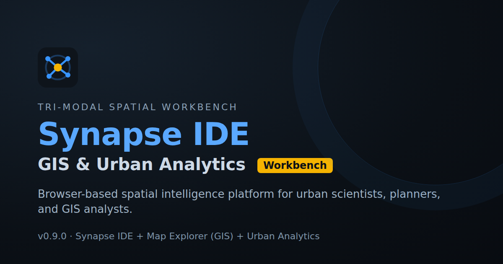

<h1>Synapse&nbsp;IDE&nbsp;—&nbsp;GIS&nbsp;&amp;&nbsp;Urban&nbsp;Analytics&nbsp;Workbench</h1>

<p><b>A tri-modal spatial intelligence platform</b> for urban science, planning, risk, equity, and evidence-based decision making.<br/>
<em>Synapse IDE · Map Explorer (GIS) · Urban Analytics</em> · <code>v0.9.0</code></p>

<p>


</p>

<table>
  <tr>
    <td width="50%" align="center" valign="top">
      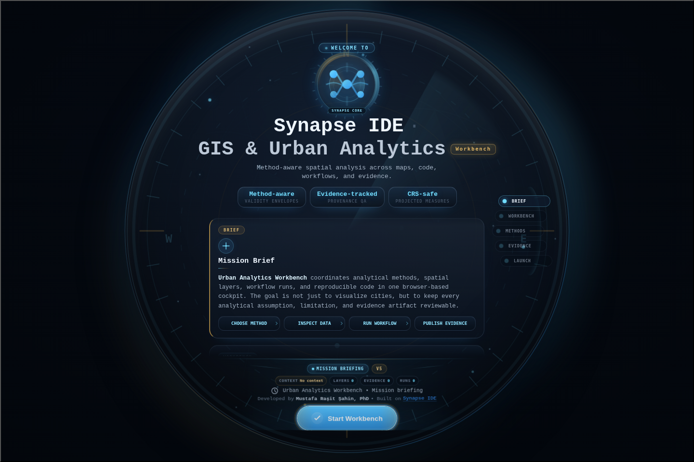<br/>
      <sub><b>Welcome cockpit</b> — orbital command surface, IDE-led brand</sub>
    </td>
    <td width="50%" align="center" valign="top">
      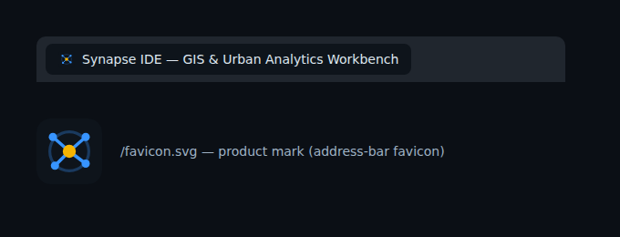<br/>
      <sub><b>Tab &amp; favicon</b> — canonical title + synapse-node product mark</sub>
    </td>
  </tr>
</table>

</div>

Repository · [Design Thesis](#1-design-thesis) · [Screen Atlas](#2-screen-atlas) · [Architecture](#3-system-architecture) · [Analytical Flows](#4-analytical-flows) · [Indicators](#5-urban-indicators--formulations) · [Map Engine](#6-map-explorer--geospatial-rendering) · [Compute](#7-engine-layer) · [AI Layer](#8-ai-orchestration) · [IDE Shell](#9-synapse-ide-shell) · [Evidence Model](#10-evidence-and-validity-model) · [Stack](#11-technology-stack) · [Quickstart](#12-quickstart) · [Validation](#13-release-validation-ladder) · [Scientific Limits](#14-scientific-limits-and-integrity)

> The city is a system. Synapse is built to read it — analytically, spatially, and honestly.

---

## 1. Design Thesis

Synapse Urban Analytics Workbench was not designed as a themed GIS viewer or a static dashboard generator.

The goal is to answer three structural problems in urban analysis work:

1. **Fragmentation** — Spatial data, analytical workflows, and AI assistance live in separate tools. Integration is manual and lossy.
2. **Opacity** — Most platforms hide method assumptions, data quality signals, and analytical boundaries behind polished charts.
3. **Reproducibility** — Analytical results that cannot be traced to method logic and data provenance are not trustworthy.

Synapse addresses all three through three bounded, contract-enforced modules operating on a shared typed event bus:

| Module | Analytical Role |
| --- | --- |
| **Synapse IDE** | Reproducible workflow authoring — Monaco editor, terminal, command palette, GIS-aware file explorer |
| **Map Explorer** | Production-grade geospatial rendering — multi-layer deck.gl engine, scientific QA, advanced cartography |
| **Urban Analytics** | Scientific analytical domain — indicators, flows, validity envelopes, evidence artifacts, data fitness |

### 1.1 Scientific Honesty Contract

The platform is intentionally explicit about capability boundaries.

- It is not a black-box policy oracle.
- It does not claim that demo-mode outputs are field-validated truth.
- It does not hide unknown data quality as high confidence — `score = null` means unknown, always.
- It does not treat EPSG:4326 as valid for metric distance or area computation.
- Method capability status is explicit: `implemented` · `demo_mode` · `residual_gap` · `environment_dependent` · `deferred`.
- Evidence artifacts are immutable once registered. Stale state is communicated via QA flags, never by silent mutation.

### 1.2 What This Repository Covers

| Domain | Content |
| --- | --- |
| Urban Analytics Domain | 40+ indicators, 16 analytical flows, seed library with 16+ thematic modules, validity envelopes |
| Geospatial Rendering | deck.gl 9 multi-layer rendering, Mapbox GL, MapLibre GL, Google Maps/Places/Street View |
| Spatial Compute | WebGPU, DuckDB-WASM, GEOS-WASM, GDAL, worker pool, R-tree spatial index |
| AI Orchestration | OpenAI, Anthropic, Gemini, Ollama with guardrails, PII redaction, streaming |
| IDE Shell | Monaco editor, xterm.js terminal, file explorer, command palette, global search |
| Python Environment | 60+ geospatial packages via conda/mamba |
| Observability | OpenTelemetry tracing and metrics, scientific QA state machine |
| Testing and Validation | Vitest + Playwright + accessibility audits + bundle budgets + RC gate |

### 1.3 What It Does Not Claim To Be

- A certified statutory planning system
- A real-time emergency-response dispatch tool
- A replacement for expert urban planning judgment
- A navigation-grade multi-body spatial ephemeris solver

What it is instead: a scientifically disciplined, visually precise, architecturally rigorous platform for urban analysis work.

---

## 2. Screen Atlas

All screenshots in this README were captured from the running application in June 2026. Every frame represents a real, interactive application state — not a static mockup.

### 2.1 Map Explorer — Full Workspace Hero

The primary interface surface: deck.gl-rendered basemap with the Layers/Data panel open, Istanbul urban context loaded, scale bar, coordinate readout, and status bar visible.

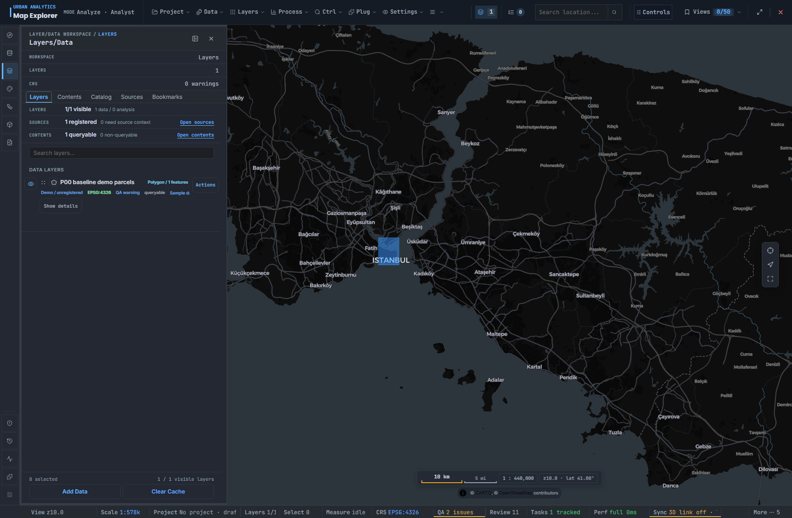

**State:** Map Explorer · Analyze mode · Layers/Data panel · Istanbul region · Scale 1:578k · View z10.0

**What this frame shows:**

- Full `URBAN ANALYTICS / Map Explorer` branding in the header
- Toolbar: Project, Data, Layers, Process, Ctrl, Plug, Settings menus
- Left activity rail with contextual panel icons
- Layers/Data workspace with layer registry, CRS warnings, Sources/Contents summary
- Interactive map canvas with Mapbox dark basemap
- Status bar: View z10.0 · Scale 1:578k · Project state · Select 0 · Measure idle · CRS EPSG:4326 · QA issues · Review events · Task tracking · Performance · Sync

### 2.2 Map Explorer — Layers Panel and Data Registry

The Layers/Data workspace shows the registered data layer stack, source context state, content queryability, and layer-level QA badge row.

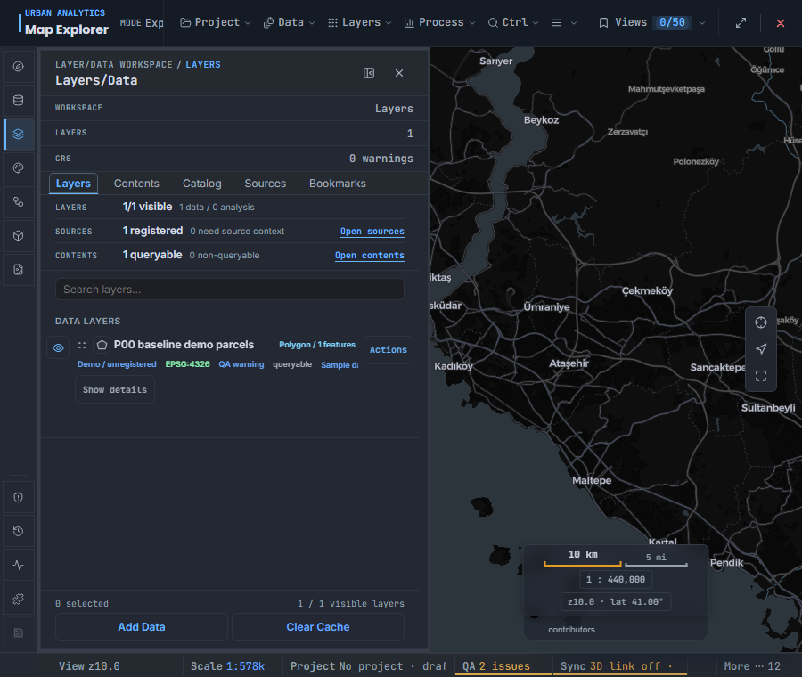

**State:** Map Explorer · Explore mode · Layers/Data panel · 1/1 visible layer

**What this frame shows:**

- Workspace summary: 1 layer visible, 1 data / 0 analysis layers
- Sources: 1 registered, 0 need source context
- Contents: 1 queryable, 0 non-queryable
- Layer entry: `P00 baseline demo parcels` — Polygon / 1 features · `Demo/unregistered` · `EPSG:4326` · `QA warning` · `queryable` · `Sample d.`
- CRS 0 warnings display and QA status badge
- Status bar: QA 2 issues · Sync 3D link off

### 2.3 Layer Inspector — Scientific QA and Metadata Summary

The Inspector panel surfaces layer identity, geometry type, QA warnings, CRS status, and actionable next steps directly in the right dock.

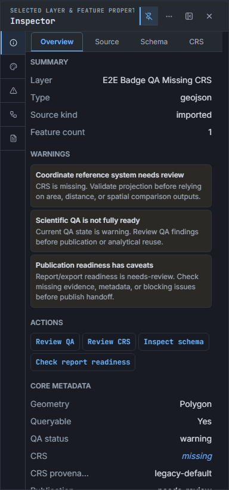

**State:** Map Explorer · Inspector · `E2E Badge QA Missing CRS` layer selected

**What this frame shows:**

- Header: `SELECTED LAYER & FEATURE PROPERTY` → `Inspector`
- Tab row: Overview · Source · Schema · CRS
- Summary: Layer name, Type (geojson), Source kind (imported), Feature count (1)
- WARNINGS section with three structured findings:
  - **Coordinate reference system needs review** — CRS is missing; validate projection before relying on area, distance, or spatial comparison outputs
  - **Scientific QA is not fully ready** — Current QA state is warning; review before publication or analytical reuse
  - **Publication readiness has caveats** — Report/export readiness is needs-review; check missing evidence before publish
- ACTIONS: `Review QA` · `Review CRS` · `Inspect schema` · `Check report readiness`
- CORE METADATA: Geometry: Polygon · Queryable: Yes · QA status: warning · CRS: **missing** · CRS provenance: legacy-default

### 2.4 Scientific QA Problems Panel

The QA Problems panel promotes scientific blockers, warnings, and caveats from layer-level state into a structured action list. Every finding carries an action target with a direct button.

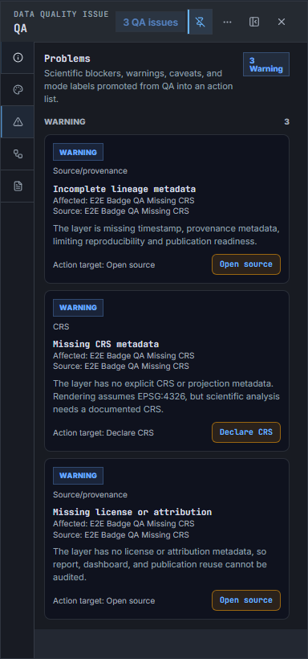

**State:** Map Explorer · DATA QUALITY ISSUE · QA tab · 3 QA issues · 3 Warnings

**What this frame shows:**

- Panel title: `DATA QUALITY ISSUE` with badge `3 QA issues`
- Sub-panel: `Problems` — Scientific blockers, warnings, caveats, and mode labels promoted from QA into an action list
- Warning 1 — `Incomplete lineage metadata` · Source/provenance · The layer is missing timestamp, provenance metadata, limiting reproducibility and publication readiness · Action: **Open source**
- Warning 2 — `Missing CRS metadata` · CRS · The layer has no explicit CRS or projection metadata; rendering assumes EPSG:4326, but scientific analysis needs a documented CRS · Action: **Declare CRS**
- Warning 3 — `Missing license or attribution` · Source/provenance · The layer has no license or attribution metadata, so report, dashboard, and publication reuse cannot be audited · Action: **Open source**

### 2.5 Model Builder — Geoprocessing Chain Configuration

The Model Builder constructs named geoprocessing chains with declared primary and overlay sources, ordered processing steps, batch target support, and evidence output to the Urban Analytics domain.

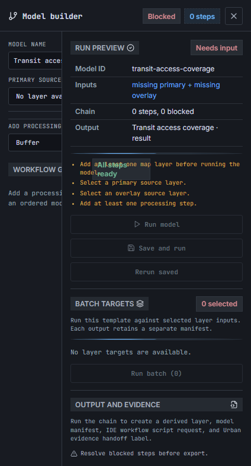

**State:** Map Explorer · Model Builder · `transit-access-coverage` model · Blocked state · 0 steps

**What this frame shows:**

- Panel: `Model builder` with `Blocked` badge and `0 steps` counter
- MODEL NAME: `Transit ace...` (transit-access-coverage)
- PRIMARY SOURCE: `No layer ava...`
- ADD PROCESSING STEP: `Buffer`
- WORKFLOW GUIDANCE: All steps · one map layer before running the model · All steps ready
- RUN PREVIEW: Model ID, Inputs (missing primary + missing overlay), Chain (0 steps, 0 blocked), Output descriptor
- BATCH TARGETS: 0 selected — Run this template against selected layer inputs; each output retains a separate manifest
- OUTPUT AND EVIDENCE: Run the chain to create a derived layer, model manifest, IDE workflow script request, and Urban Analytics evidence handoff label

### 2.6 Attribute Table — Feature Data and Scoring

The attribute table surfaces raw feature-level data with field profile and calculator tab access, showing how spatial features carry scoring, classification, and analytical metadata.

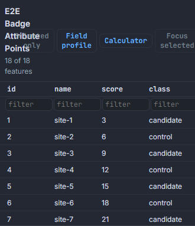

**State:** Map Explorer · Attribute table · `E2E Badge Attribute Points` · 18 of 18 features

**What this frame shows:**

- Header: Layer name, feature count (18 of 18)
- Tab row: `Overview` · `Field profile` · `Calculator` · `Focus selected`
- Columns: id (filter) · name (filter) · score (filter) · class (filter)
- Sample rows: site-1 score 3 candidate, site-2 score 6 control, site-3 score 9 candidate... site-7 score 21 candidate
- Analytical scoring data visible for downstream indicator computation

### 2.7 Collaborative Review Workspace

The Review workspace maintains an auditable timeline of map session events, separating imports, commands, QA events, workflow outputs, report handoffs, and exports into structured categories.

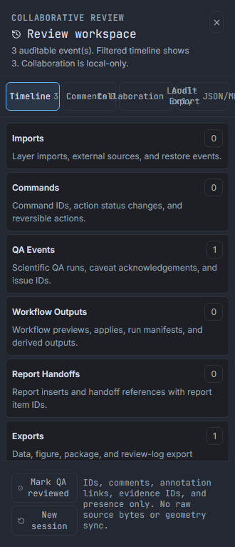

**State:** Map Explorer · COLLABORATIVE REVIEW · Review workspace · 3 auditable events · Local-only collaboration

**What this frame shows:**

- Header: `COLLABORATIVE REVIEW` → `Review workspace`
- Summary: 3 auditable event(s); Filtered timeline shows 3; Collaboration is local-only
- Tab row: Timeline · Comments · Collaboration · Audit/Export · JSON/M...
- Event categories:
  - **Imports** (0) — Layer imports, external sources, and restore events
  - **Commands** (0) — Command IDs, action status changes, reversible actions
  - **QA Events** (1) — Scientific QA runs, caveat acknowledgements, issue IDs
  - **Workflow Outputs** (0) — Workflow previews, applies, run manifests, derived outputs
  - **Report Handoffs** (0) — Report inserts and handoff references with report item IDs
  - **Exports** (1) — Data, figure, package, and review-log export
- Action buttons: `Mark QA reviewed` · `New session`
- Audit note: IDs, comments, annotation links, evidence IDs, and presence only. No raw source bytes or geometry sync.

### 2.8 Sun/Shadow Analysis Panel

The Sun/Shadow Analysis panel computes solar position and shadow accumulation with explicit scientific mode declarations and evidence publication actions.

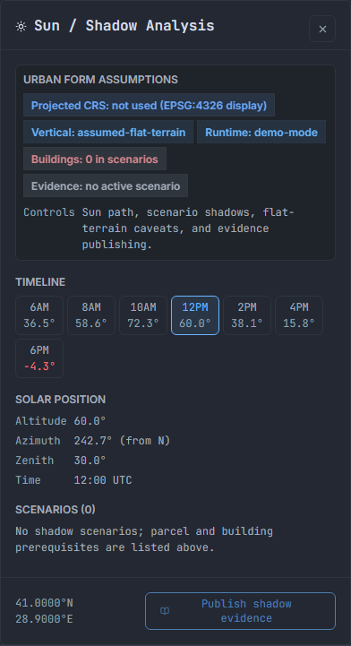

**State:** Map Explorer · Sun / Shadow Analysis overlay · Istanbul coordinates 41.00°N / 28.90°E

**What this frame shows:**

- Panel: `Sun / Shadow Analysis`
- URBAN FORM ASSUMPTIONS badges:
  - `Projected CRS: not used (EPSG:4326 display)` — orange warning
  - `Vertical: assumed-flat-terrain`
  - `Runtime: demo-mode` — orange
  - `Buildings: 0 in scenarios`
  - `Evidence: no active scenario`
- Descriptive note: Controls Sun path, scenario shadows, flat-terrain caveats, and evidence publishing
- TIMELINE: 6AM 36.5° / 8AM 58.6° / 10AM 72.3° / **12PM 60.0°** (selected) / 2PM 38.1° / 4PM 15.8° / 6PM -4.3°
- SOLAR POSITION: Altitude 60.0° · Azimuth 242.7° (from N) · Zenith 30.0° · Time 12:00 UTC
- SCENARIOS (0): No shadow scenarios; parcel and building prerequisites are listed above
- Action: `Publish shadow evidence`
- Coordinates: 41.0000°N · 28.9000°E

### 2.9 Layer Style Workspace

The Style workspace provides per-layer rendering configuration across Renderer, Symbols, Labels, Legend, and Advisor tabs — with QA status badges and live preview.

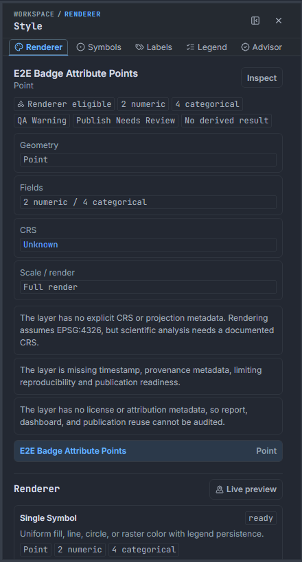

**State:** Map Explorer · WORKSPACE / RENDERER · Style panel · `E2E Badge Attribute Points` layer

**What this frame shows:**

- Breadcrumb: `WORKSPACE / RENDERER` → `Style`
- Tab row: `Renderer` · Symbols · Labels · Legend · Advisor
- Layer name: `E2E Badge Attribute Points` · Type: Point · Inspect button
- Status badges: `Renderer eligible` · `2 numeric` · `4 categorical` · `QA Warning` · `Publish Needs Review` · `No derived result`
- GEOMETRY: Point
- FIELDS: 2 numeric / 4 categorical
- CRS: **Unknown** (highlighted in orange)
- Scale / render: Full render
- Three scientific warning notes visible regarding CRS, timestamp provenance, and license/attribution
- Layer reference with Point type annotation
- RENDERER: `Single Symbol` · ready · Uniform fill, line, circle, or raster color with legend persistence · Point · 2 numeric · 4 categorical
- Live preview toggle

### 2.10 Render Diagnostics — Performance and Budget

The Performance diagnostic panel surfaces live layer budgets, worker transfer totals, render mode, export timing, and budget status for the current map session.

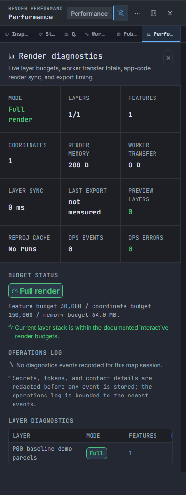

**State:** Map Explorer · RENDER PERFORMANCE · Performance tab · Full render mode

**What this frame shows:**

- Header: `RENDER PERFORMANC...` → `Performance` (tab group: Insp... · St... · Q... · Wor... · Pub... · Perfo...)
- Sub-panel: `Render diagnostics` — Live layer budgets, worker transfer totals, app-code render sync, and export timing
- Metrics grid:
  - MODE: **Full render** (green)
  - LAYERS: 1/1
  - FEATURES: 1
  - COORDINATES: 1
  - RENDER MEMORY: **288 B**
  - WORKER TRANSFER: **0 B**
  - LAYER SYNC: **0 ms**
  - LAST EXPORT: not measured
  - PREVIEW LAYERS: 0
  - REPROJ CACHE: No runs
  - OPS EVENTS: 0
  - OPS ERRORS: 0 (green)
- BUDGET STATUS: `Full render` badge (green) — Feature budget 30,000 / coordinate budget 150,000 / memory budget 64.0 MB — Current layer stack is within documented interactive render budgets
- OPERATIONS LOG: No diagnostics events recorded for this map session · Secrets, tokens, and contact details are redacted before any event is stored; the log is bounded to the newest events
- LAYER DIAGNOSTICS: Table with LAYER · MODE · FEATURES columns → P00 baseline demo parcels · Full · 1

### 2.11 Scientific QA — Problems Action List

The Problems panel inside the right dock provides a consolidated view of all active scientific issues with direct action buttons — not just passive notifications.

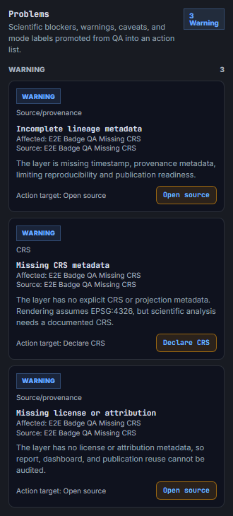

**State:** Map Explorer · Problems panel · 3 Warning items active

**What this frame shows:**

- Identical scientific QA warnings surfaced through the problems aggregation surface
- Each warning has a structured action target with a button inline
- CRS warning prompts `Declare CRS` directly from the problems list
- Source/provenance warnings prompt `Open source`
- Design principle: problems are actionable, not decorative

### 2.12 Model Builder — Configured State with Batch Targets

The Model Builder in a configured state shows full batch target specification and output evidence route.

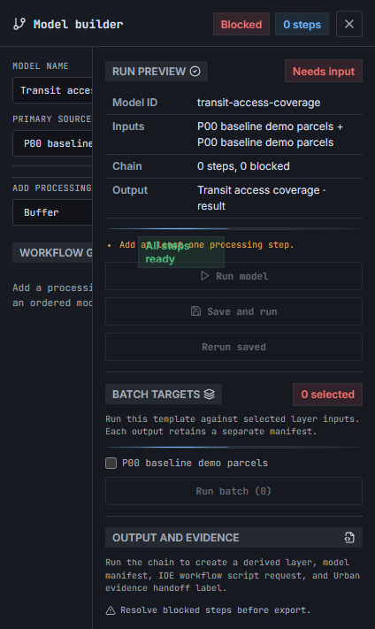

**State:** Map Explorer · Model Builder · `transit-access-coverage` · Sources configured · Batch available

**What this frame shows:**

- Inputs: P00 baseline demo parcels + P00 baseline demo parcels
- Chain: 0 steps, 0 blocked
- Guidance: Add at least one processing step · All steps ready
- BATCH TARGETS: P00 baseline demo parcels checkbox · Run batch (0)
- OUTPUT AND EVIDENCE: Run the chain to create a derived layer, model manifest, IDE workflow script request, and Urban Analytics evidence handoff label · Resolve blocked steps before export

---

## 3. System Architecture

### 3.1 Tri-Modal System Overview


```mermaid
flowchart LR
  subgraph IDE["Synapse IDE"]
    ME[Monaco Editor]
    TT[xterm Terminal]
    FE[File Explorer\nGIS icons]
    CP[Command Palette]
    GS[Global Search]
    AI[AI Chat Panels]
  end

  subgraph MAP["Map Explorer"]
    BM[Basemap Manager]
    LS[Layer Stack]
    VP[Viewport + Scientific QA]
    TL[Temporal Slider]
    DR[Draw Tools]
    EX[Export + Print Composer]
  end

  subgraph UA["Urban Analytics"]
    IC[Indicator Calculators]
    FL[Flow Library]
    SL[Seed Card Library]
    EV[Evidence Registry]
    VE[Validity Envelopes]
    DF[Data Fitness Scoring]
  end

  subgraph ENG["Engine Layer"]
    GPU[WebGPU Spatial\nCompute]
    DDB[DuckDB-WASM\nIn-browser SQL]
    NET[Network Analysis\nDijkstra · A-star]
    WAS[GEOS-WASM\nGDAL-WASM]
    WRK[Worker Pool\nGWR · Hash · PII]
    STR[Streaming\nMQTT · WebSocket]
  end

  subgraph OBS["Observability"]
    OT[OpenTelemetry]
    EB[Error Bus]
    QA[Scientific QA Gates]
  end

  IDE --> UA
  MAP --> UA
  UA --> ENG
  ENG --> MAP
  UA <--> OBS
  MAP <--> OBS
  IDE <--> OBS
```

### 3.2 Cross-Module Contract Architecture

Cross-module communication is typed and contract-first. No implicit coupling between bounded modules.

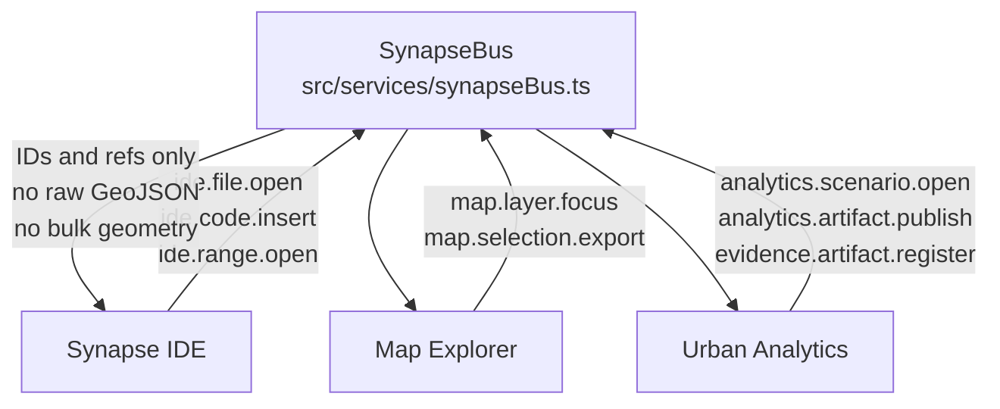
```mermaid
flowchart TD
  SB[SynapseBus\nsrc/services/synapseBus.ts]

  IDE_MOD[Synapse IDE] -->|ide.file.open\nide.code.insert\nide.range.open| SB
  MAP_MOD[Map Explorer] -->|map.layer.focus\nmap.selection.export| SB
  UA_MOD[Urban Analytics] -->|analytics.scenario.open\nanalytics.artifact.publish\nevidence.artifact.register| SB

  SB -->|IDs and refs only\nno raw GeoJSON\nno bulk geometry| IDE_MOD
  SB --> MAP_MOD
  SB --> UA_MOD
```

**Bus rule:** payloads carry identifiers and references only. Consumers read their own store after receiving an event. Heavy geometry never travels through the event bus.

### 3.3 State Management Architecture

All state is Zustand. No Redux, no Context API for application state.

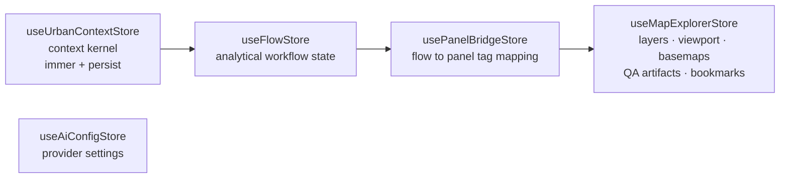
```mermaid
graph LR
  UC[useUrbanContextStore\ncontext kernel\nimmer + persist]
  UF[useFlowStore\nanalytical workflow state]
  UB[usePanelBridgeStore\nflow to panel tag mapping]
  ME[useMapExplorerStore\nlayers · viewport · basemaps\nQA artifacts · bookmarks]
  AC[useAiConfigStore\nprovider settings]

  UC --> UF
  UF --> UB
  UB --> ME
```

**Persistence namespace:** `urban.ctx.*` and `urban.config.*` through Zustand persist middleware. No direct `localStorage` access.

### 3.4 Data and Evidence Lifecycle

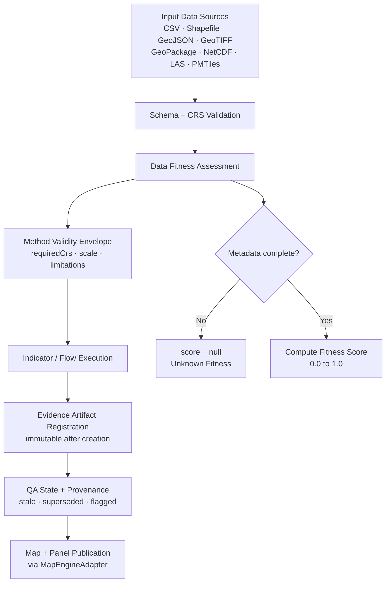
```mermaid
flowchart TD
  DS[Input Data Sources\nCSV · Shapefile · GeoJSON · GeoTIFF\nGeoPackage · NetCDF · LAS · PMTiles]
  SC[Schema + CRS Validation]
  DF[Data Fitness Assessment]
  VE[Method Validity Envelope\nrequiredCrs · scale · limitations]
  EX[Indicator / Flow Execution]
  EA[Evidence Artifact Registration\nimmutable after creation]
  QA[QA State + Provenance\nstale · superseded · flagged]
  PB[Map + Panel Publication\nvia MapEngineAdapter]

  DS --> SC
  SC --> DF
  DF --> VE
  VE --> EX
  EX --> EA
  EA --> QA
  QA --> PB

  DF --> FM{Metadata complete?}
  FM -- No --> FN[score = null\nUnknown Fitness]
  FM -- Yes --> FS[Compute Fitness Score\n0.0 to 1.0]
```

---

## 4. Analytical Flows

Synapse includes **16 structured analytical flow builders** — each a self-contained multi-step guided workflow with explicit method validity, evidence documentation, and analytical boundary declarations.

### 4.1 Flow Inventory

| Flow | Category | Analytical Purpose |
| --- | --- | --- |
| **Multi-Criteria Site Suitability** | SPATIAL_ANALYSIS | Weighted overlay combining environmental, infrastructure, and socioeconomic layers to rank candidate sites. Supports AHP, rank-sum, equal weighting, and manual allocation. |
| **Network Accessibility Analysis** | SPATIAL_ANALYSIS | Isochrone-based accessibility scoring across walk, cycle, transit, and drive modes. Hansen-type gravity model with equity disaggregation. |
| **Land-Use Change Detection** | SPATIAL_ANALYSIS | Temporal comparison of satellite or vector land-cover layers. Transition matrix, expansion hotspots, green-cover change. |
| **Emerging Hot Spot Analysis** | SPATIAL_ANALYSIS | Spatiotemporal Gi* clustering across ordered time fields. Classifies trajectory patterns: new, persistent, intensifying, diminishing, sporadic. |
| **Urban Morphology Clustering** | SPATIAL_ANALYSIS | Multivariate k-means segmentation of districts into interpretable morphotypes using accessibility, environment, burden, and opportunity indicators. |
| **Urban Object Detection** | SPATIAL_ANALYSIS | GeoAI screening of very-high-resolution imagery for vehicles, trees, solar panels, pools, and construction sites via ONNX Runtime Web. |
| **Composite Indicator Builder** | INDICATOR_ASSESSMENT | OECD/JRC-style composite index with 7 staged controls: imputation, normalization, weighting, aggregation, uncertainty, sensitivity, reporting. |
| **Vulnerability & Risk Assessment** | RISK_EQUITY | Multi-hazard vulnerability mapping combining exposure, sensitivity, and adaptive capacity. IPCC vulnerability framework. |
| **Equity & Distributional Audit** | RISK_EQUITY | Spatial equity analysis of amenity and hazard distribution across demographic groups. Disparity metrics: Gini, concentration index, gap ratios. |
| **VoxCity 3D Building Viewer** | SIMULATION_3D | Extrude building footprints to interactive 2.5D geometry. LOD levels, deterministic height derivation, thematic attribute styling. |
| **CityJSON 3D Model Loader** | SIMULATION_3D | Import CityJSON v2.0 models with semantic surface preservation. Attribute queries on CityObjects. |
| **Sunlight & Shadow Simulation** | SIMULATION_3D | Sun position and shadow accumulation over configurable date/time range. Per-building solar exposure hours with animated playback. |
| **Facility Siting & Location-Allocation** | SIMULATION_3D | Service siting with p-median, LSCP, and MCLP variants. Efficiency-equity trade-off, catchment visualization, scenario comparison. |
| **Urban Growth Cellular Automata** | SIMULATION_3D | Transition-rule CA model for urban expansion simulation. Neighborhood influence, land-use transition probabilities, growth boundary constraints. |
| **System Dynamics** | SIMULATION_3D | Stock-and-flow population/service dynamics with feedback loops. Growth, migration, and service-saturation scenarios. |
| **Scenario Comparison** | SCENARIO_REVIEW | Side-by-side evidence artifact comparison across analytical runs. Structured delta analysis with documented decision rationale. |

### 4.2 Flow State Machine

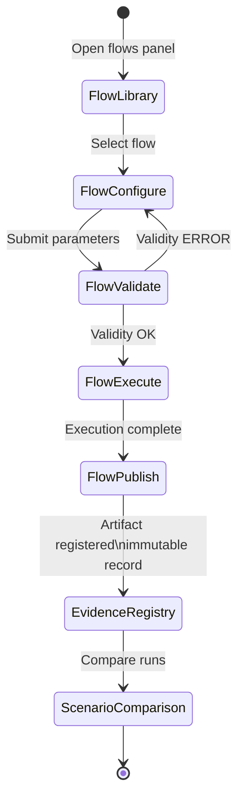
```mermaid
stateDiagram-v2
  [*] --> FlowLibrary : Open flows panel
  FlowLibrary --> FlowConfigure : Select flow
  FlowConfigure --> FlowValidate : Submit parameters
  FlowValidate --> FlowExecute : Validity OK
  FlowValidate --> FlowConfigure : Validity ERROR
  FlowExecute --> FlowPublish : Execution complete
  FlowPublish --> EvidenceRegistry : Artifact registered\nimmutable record
  EvidenceRegistry --> ScenarioComparison : Compare runs
  ScenarioComparison --> [*]
```

### 4.3 Analytical Boundary Contract

Every analytical flow exposes a `UrbanMethodValidityEnvelope` and a `boundary` declaration:

```typescript
// From flowLibraryMeta.ts — Site Suitability
{
  boundary: "Produces a ranked suitability surface. Does not constitute a " +
            "zoning decision or binding land-use recommendation.",
  validityEnvelope: {
    capabilityStatus: 'implemented',   // or 'demo_mode' | 'residual_gap' | 'deferred'
    requiredCrs: 'EPSG:32636',         // never EPSG:4326 for metric ops
    validScales: ['neighbourhood', 'district', 'city'],
    knownLimitations: ['...'],
    methodReferences: ['...'],
  }
}
```

---

## 5. Urban Indicators & Formulations

The platform contains **40+ deterministic, transparent, and reference-documented indicator calculators** organized into eight functional groups.

### 5.1 Morphology Indicators

Grounded in Spacematrix theory (Berghauser Pont & Haupt, 2010).

| Indicator | Symbol | Formula |
| --- | --- | --- |
| Floor Area Ratio | FAR | $FAR = \sum GFA_i \;/\; A_{lot}$ |
| Ground Space Index | GSI | $GSI = A_{footprint} \;/\; A_{lot}$ |
| Open Space Ratio | OSR | $OSR = (A_{lot} - A_{footprint}) \;/\; \sum GFA_i$ |
| Mixed-Use Index | MUI | $MUI = -\sum_{k} p_k \ln p_k$ |
| Street Connectivity | CONI | $CONI = N_{intersections} \;/\; A_{study} \times 10^6$ |

**FAR spatial classification bands:**

| Band | FAR range | Morphology type |
| --- | --- | --- |
| Low | < 0.5 | Suburban or rural fringe |
| Medium | 0.5 – 1.5 | Residential urban |
| High | 1.5 – 3.0 | Mixed-use urban |
| Very High | > 3.0 | CBD or high-rise core |

### 5.2 Accessibility Indicators

Derived from Walk Score methodology (Carr et al., 2010) and Hansen (1959).

**Walk Score — 9-category polynomial distance-decay:**

$$
WS = 100 \cdot \frac{\sum_{c=1}^{9} w_c \cdot D(d_c)}{\sum_{c=1}^{9} w_c}
$$

where the decay function is:

$$
D(d) = \begin{cases} 1 & d \leq 400\text{ m} \\ 1 - \dfrac{d - 400}{1200} & 400 < d \leq 1600\text{ m} \\ 0 & d > 1600\text{ m} \end{cases}
$$

**Walk Score bands:**

| Score | Classification |
| --- | --- |
| 0 – 24 | Car-dependent (almost all errands require a car) |
| 25 – 49 | Car-dependent (some walkable amenities) |
| 50 – 69 | Somewhat walkable |
| 70 – 89 | Very walkable |
| 90 – 100 | Walker's paradise |

**Hansen Gravity Accessibility:**

$$
A_i = \sum_{j} O_j \cdot e^{-\beta c_{ij}}
$$

where $O_j$ is opportunity mass at destination $j$ and $c_{ij}$ is generalized travel cost.

**Cumulative Opportunities:**

$$
A_i^{CO} = \sum_{j} O_j \cdot \mathbf{1}[c_{ij} \leq \theta]
$$

| Indicator | Description |
| --- | --- |
| Walk Score (0–100) | Pedestrian amenity access with distance-decay weighting across 9 categories |
| Transit Accessibility | Frequency-weighted stop coverage within configurable buffer |
| Cumulative Opportunities | Count of reachable destinations within travel-time threshold |
| Gravity Accessibility | Exponential distance-decay opportunity measure |
| SDG 11.2.1 | Population within 500 m of min. 20-min-frequency transit stop |

### 5.3 Environmental Indicators

| Indicator | Formula | Reference |
| --- | --- | --- |
| NDVI | $NDVI = (NIR - RED)/(NIR + RED)$ | Rouse et al. (1973) |
| Urban Heat Island Intensity | $UHI = LST_{urban} - LST_{rural}$ | Oke (1982) |
| Tree Canopy Coverage | $TCC = A_{canopy} / A_{study} \times 100$ | — |
| Green Space Per Capita | $GSPC = A_{green} / P_{resident}$ | — |
| Impervious Surface Fraction | $ISF = A_{impervious} / A_{study} \times 100$ | — |
| NDWI | $NDWI = (GREEN - NIR)/(GREEN + NIR)$ | McFeeters (1996) |
| EVI | $EVI = 2.5 \cdot (NIR - RED)/(NIR + 6 \cdot RED - 7.5 \cdot BLUE + 1)$ | Liu & Huete (1995) |

**NDVI classification:**

| Value | Interpretation |
| --- | --- |
| < 0.0 | Water or cloud |
| 0.0 – 0.10 | Bare soil or impervious surface |
| 0.10 – 0.30 | Sparse vegetation |
| 0.30 – 0.60 | Moderate vegetation |
| > 0.60 | Dense or healthy vegetation |

### 5.4 Socioeconomic Indicators

**Gini Coefficient (Gini, 1912):**

$$
G = \frac{2 \sum_{i=1}^{n} i \cdot y_i}{n \cdot \sum_{i=1}^{n} y_i} - \frac{n+1}{n}
$$

where $y_i$ are sorted income values. Range: 0 (perfect equality) — 1 (maximum inequality).

**Gini band interpretation:**

| Gini value | Inequality level |
| --- | --- |
| 0.00 – 0.25 | Low inequality |
| 0.25 – 0.35 | Moderate |
| 0.35 – 0.45 | High inequality |
| > 0.45 | Very high — policy-relevant |

**Shannon Diversity (Population):**

$$
H = -\sum_{k=1}^{K} p_k \ln p_k
$$

**Jobs-Housing Balance:**

$$
JHB = N_{jobs} \;/\; N_{housing\_units}
$$

| Indicator | Description |
| --- | --- |
| Gini Coefficient | Income inequality measure across spatial units |
| Shannon / Simpson Diversity | Population demographic diversity |
| Jobs-Housing Balance | Employment-to-housing ratio |
| Displacement Risk | Gentrification and displacement vulnerability composite |
| Education Access Index | Distance-decay weighted school accessibility |

### 5.5 Resilience and SDG 11 Indicators

**Social Vulnerability Index (Cutter et al., 2003):**

$$
SoVI = \frac{1}{n} \sum_{k=1}^{n} f_k, \quad f_k \in [0, 1]
$$

where $f_k$ are normalized vulnerability dimensions: elderly population, young children, poverty rate, linguistic isolation, renter fraction, disability rate, and education attainment.

**SoVI interpretation bands:**

| Score | Vulnerability level |
| --- | --- |
| 0 – 25 | Low |
| 25 – 50 | Moderate |
| 50 – 75 | High |
| > 75 | Very high |

**Compound Risk Index:**

$$
CRI = w_H \cdot H + w_E \cdot E + w_S \cdot S + w_{AC} \cdot (1 - AC)
$$

where $H$ = Hazard, $E$ = Exposure, $S$ = Sensitivity, $AC$ = Adaptive Capacity.

**SDG 11 Indicator Suite — all seven UN sub-indicators implemented:**

| SDG Code | Indicator | Formula |
| --- | --- | --- |
| 11.1.1 | Proportion in inadequate housing | $(P_{inadequate} / P_{urban}) \times 100$ |
| 11.2.1 | Convenient transit access | $(P_{transit\_access} / P_{urban}) \times 100$ |
| 11.3.1 | Land consumption rate vs population | $\Delta A_{urban}/A_0 \;\div\; \Delta P/P_0$ |
| 11.3.2 | Civil society participation | Survey-based civic engagement score |
| 11.6.2 | Air quality PM2.5 | Annual mean PM2.5 µg/m³ |
| 11.7.1 | Open public space fraction | $(A_{public\_open} / A_{built\_up}) \times 100$ |

### 5.6 Transport and Network Formulations

**Space Syntax — Normalized Integration (Hillier & Hanson, 1984):**

$$
RA_i = \frac{2(MD_i - 1)}{n - 2}
$$

where $MD_i$ is mean depth from segment $i$ and $n$ is the number of segments.

**Getis-Ord Gi* (Getis & Ord, 1992) — used in Emerging Hot Spot flow:**

$$
G_i^* = \frac{\sum_j w_{ij} x_j - \bar{X} \sum_j w_{ij}}{S \sqrt{\dfrac{n \sum_j w_{ij}^2 - \left(\sum_j w_{ij}\right)^2}{n-1}}}
$$

**Global Moran's I (Moran, 1950):**

$$
I = \frac{N}{W} \cdot \frac{\sum_i \sum_j w_{ij}(x_i - \bar{x})(x_j - \bar{x})}{\sum_i (x_i - \bar{x})^2}
$$

**Hot spot trajectory types produced by the Emerging Hot Spot flow:**

| Pattern | Description |
| --- | --- |
| New hot spot | Significant in final time step only |
| Consecutive hot spot | Significant in ≥90% of time steps with no interruption |
| Intensifying hot spot | Significant in ≥90% of time steps with increasing intensity |
| Persistent hot spot | Significant in ≥90% with no discernible trend |
| Diminishing hot spot | Significant in ≥90% with decreasing intensity |
| Sporadic hot spot | On/off alternating significance |
| Oscillating hot spot | Alternates between significant hot and cold |
| Historical hot spot | Not significant in last two time steps |

### 5.7 Full Calculator Module Inventory

| Calculator Module | Indicators |
| --- | --- |
| `morphology.ts` | FAR, GSI, OSR, Mixed-Use Index, Street Connectivity |
| `accessibility.ts` | Walk Score, Transit Accessibility, Cumulative Opportunities, Gravity Accessibility |
| `environment.ts` | NDVI, UHI, Green Space Per Capita, Tree Canopy, Impervious Surface, EVI, NDWI |
| `socioeconomic.ts` | Gini Coefficient, Shannon Diversity, Jobs-Housing Balance, Displacement Risk |
| `resilience.ts` | SoVI, Flood Exposure, Adaptive Capacity, Compound Risk Index |
| `sdg11.ts` | SDG 11.1.1 through 11.7.1 — six official UN sub-indicators |
| `transportMobility.ts` | Network Density, Intersection Density, Circuity, Service Coverage |
| `urbanFormLandscape.ts` | Sprawl Index, Compactness, Fractal Dimension |
| `socialLiveability.ts` | Health Facility Access, Cultural Facility Access |
| `energyClimate.ts` | Building Energy Intensity, Renewable Energy Fraction |
| `waterInfrastructure.ts` | Water Coverage, Flood Risk Exposure |
| `pandemicResilience.ts` | Health Capacity Index, Overcrowding Risk |
| `governanceInnovation.ts` | Smart City Readiness, Digital Infrastructure Index |
| `heritageCulture.ts` | Cultural Asset Density, Heritage Conservation Coverage |

---

## 6. Map Explorer & Geospatial Rendering

### 6.1 Layer Architecture

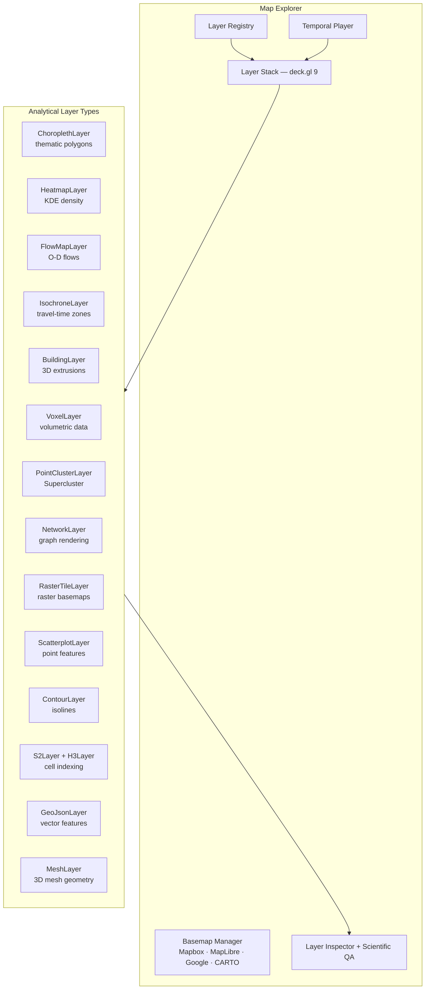
```mermaid
flowchart TB
  subgraph ME[Map Explorer]
    BM_ME[Basemap Manager\nMapbox · MapLibre · Google · CARTO]
    LR_ME[Layer Registry]
    LS_ME[Layer Stack — deck.gl 9]
    LI_ME[Layer Inspector + Scientific QA]
    TP_ME[Temporal Player]
  end

  subgraph LAYERS[Analytical Layer Types]
    CH[ChoroplethLayer\nthematic polygons]
    HM[HeatmapLayer\nKDE density]
    FL_L[FlowMapLayer\nO-D flows]
    IS[IsochroneLayer\ntravel-time zones]
    BL[BuildingLayer\n3D extrusions]
    VX[VoxelLayer\nvolumetric data]
    PC[PointClusterLayer\nSupercluster]
    NT[NetworkLayer\ngraph rendering]
    RT[RasterTileLayer\nraster basemaps]
    SC_L[ScatterplotLayer\npoint features]
    CN[ContourLayer\nisolines]
    SP[S2Layer + H3Layer\ncell indexing]
    GJ[GeoJsonLayer\nvector features]
    ML[MeshLayer\n3D mesh geometry]
  end

  LR_ME --> LS_ME
  LS_ME --> LAYERS
  LAYERS --> LI_ME
  TP_ME --> LS_ME
```

### 6.2 Map Format and Source Support

| Format | Read | Streaming | Notes |
| --- | --- | --- | --- |
| GeoJSON / NDJSON | ✓ | ✓ | Full feature collection |
| Shapefile (SHP/DBF) | ✓ | — | via shpjs |
| CSV (geocoded) | ✓ | — | Auto-detect lat/lon |
| GeoPackage (GPKG) | ✓ | — | via loaders.gl |
| GeoTIFF | ✓ | ✓ | via geotiff.js |
| FlatGeobuf | ✓ | ✓ | Streaming spatial index |
| PMTiles | ✓ | ✓ | Cloud-optimized tiles |
| NetCDF | ✓ | — | via loaders.gl |
| LAS/LAZ (point cloud) | ✓ | — | via loaders.gl + Potree |
| 3D Tiles | ✓ | ✓ | via @loaders.gl/3d-tiles |
| CityJSON | ✓ | — | Semantic surface types |
| WMS / WMTS | ✓ | — | OGC tile services |
| Parquet (spatial) | ✓ | — | via parquet-wasm + Arrow |
| MQTT / WebSocket | — | ✓ | Real-time geodata ingestion |

### 6.3 Map Analysis Capabilities

| Capability | Description |
| --- | --- |
| Attribute Join | Field-to-geometry join with configurable match strategy |
| Temporal Playback | Timeline-driven layer animation with speed controls |
| Spatial Filter | Interactive area selection for layer subsetting |
| Swipe Comparison | Side-by-side temporal or thematic layer comparison |
| Choropleth Classification | Natural breaks, quantile, equal interval, manual |
| Evidence Publication | Artifact registration from map state with provenance |
| AI Guardrails | Layer action safety review with PII-aware filtering |
| Layer Export | GeoJSON, PNG, PDF export with spatial context |
| Drawing Tools | Point, line, polygon annotation with attribute editing |
| Measurement | Distance and area in configurable units |
| Bookmarks | Named camera and layer state for reproducible views |
| Processing Toolbox | In-browser spatial geoprocessing operations |
| Print Composer | Map layout with legend, scale bar, title |
| Scene 3D | Three.js camera and lighting for 3D scene composition |
| Column I/O | Arrow and Parquet columnar geodata workflows |
| Scientific QA | Per-layer QA state with finding registry and action list |
| Collaborative Review | Auditable event timeline with session and JSON export |
| AI Copilot Proposals | Guardrail-reviewed map action proposals |
| Model Builder | Named geoprocessing chains with evidence handoff |
| Streaming Ingestion | MQTT/WebSocket live layer updates |

### 6.4 Google Maps Platform Integration

Full Google Maps Platform support including:

- **Google Maps View** — Maps JavaScript API with styling customization
- **Places Search** — Autocomplete and Place Details
- **Directions** — Multi-modal routing with visualization
- **Street View** — Immersive panorama viewer integration
- **deck.gl overlay** — All analytical layers rendered atop Google Maps basemap

---

## 7. Engine Layer

### 7.1 WebGPU Spatial Compute Engine

GPU-accelerated raster operations with transparent JavaScript fallback when WebGPU is unavailable.

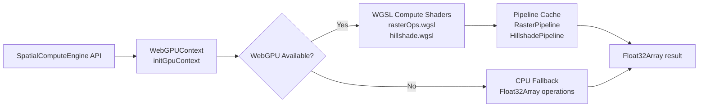
```mermaid
flowchart LR
  API_GPU[SpatialComputeEngine API]
  CTX_GPU[WebGPUContext\ninitGpuContext]

  API_GPU --> CTX_GPU
  CTX_GPU --> GPU_CHK{WebGPU Available?}
  GPU_CHK -- Yes --> SH[WGSL Compute Shaders\nrasterOps.wgsl\nhillshade.wgsl]
  GPU_CHK -- No --> FB[CPU Fallback\nFloat32Array operations]

  SH --> PIPE[Pipeline Cache\nRasterPipeline\nHillshadePipeline]
  PIPE --> OUT_GPU[Float32Array result]
  FB --> OUT_GPU
```

**GPU-accelerated operations:**

| Operation | Description |
| --- | --- |
| `computeNDVI(nir, red)` | Band ratio computation on full raster arrays via compute shader |
| `computeBandMath(a, b, op)` | add / subtract / multiply / divide / ndiff operations |
| `computeHillshade(dem, w, h, ...)` | DEM hillshading with configurable azimuth and altitude |
| `computeKDE(points, w, h, bbox, bw)` | Kernel density estimation from point feature arrays |

### 7.2 DuckDB-WASM Spatial Database

In-browser analytical SQL engine for large tabular and spatial workloads.

- Full SQL with spatial extensions (`ST_*` functions)
- Apache Arrow columnar in/out
- Parquet read and write
- Large dataset joins and aggregations without server round-trips
- FlatGeobuf and GeoPackage integration

### 7.3 Background Worker Pool

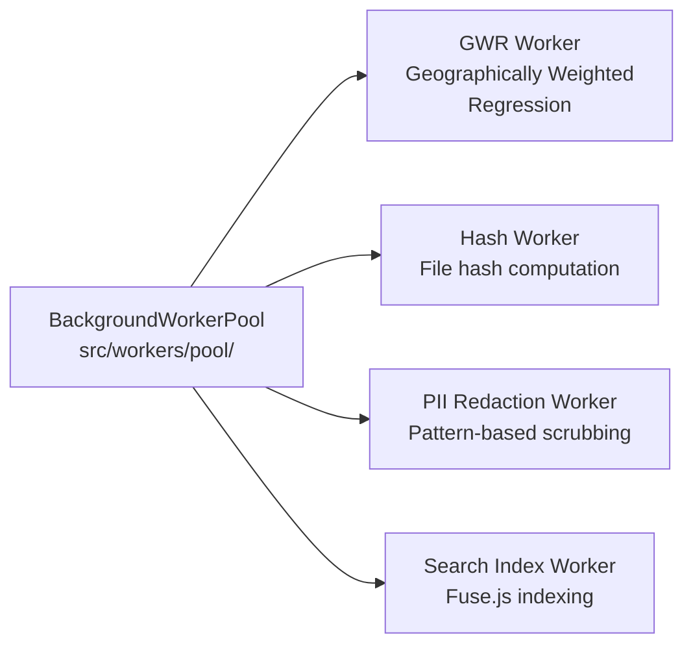
```mermaid
flowchart LR
  POOL[BackgroundWorkerPool\nsrc/workers/pool/]
  W1[GWR Worker\nGeographically Weighted\nRegression]
  W2[Hash Worker\nFile hash computation]
  W3[PII Redaction Worker\nPattern-based scrubbing]
  W4[Search Index Worker\nFuse.js indexing]

  POOL --> W1
  POOL --> W2
  POOL --> W3
  POOL --> W4
```

Resource-isolated computation. The main thread is never blocked by heavy spatial loops over large feature sets.

### 7.4 WASM Spatial Modules

| Module | Path | Capabilities |
| --- | --- | --- |
| GEOS-WASM | `src/engine/wasm/` | Geometry operations, buffer, union, intersection, validation |
| GDAL-WASM | `src/engine/wasm/` | Format conversion, reprojection, raster processing |
| SpatialIndexWASM | `src/engine/wasm/SpatialIndexWASM.ts` | R-tree spatial index with JS fallback |

### 7.5 Network Analysis Engine

| Operation | Algorithm | Description |
| --- | --- | --- |
| Shortest path | Dijkstra / A* | Single-origin routing with impedance weighting |
| Isochrones | Distance-contour expansion | Travel-time reachability zones |
| Space syntax | Angular-segment analysis | Normalized integration for street network reading |
| Betweenness centrality | Graph traversal | Node criticality for flow routing |
| Service area | Multi-origin expansion | Coverage area for facility location |

### 7.6 Spatial Statistics Engine

| Method | Description |
| --- | --- |
| Getis-Ord Gi* | Spatiotemporal hot spot classification |
| Global Moran's I | Spatial autocorrelation |
| LISA | Local Indicators of Spatial Association |
| GWR | Geographically Weighted Regression (worker-isolated) |
| Kriging | Spatial interpolation for continuous fields |

### 7.7 GeoAI Object Detection Pipeline

Object detection pipeline (`src/engine/geoai/`) using ONNX Runtime Web:

- Browser-managed model loading and inference
- Configurable confidence threshold and NMS parameters
- Target classes: vehicles, trees, solar panels, swimming pools, construction sites
- Deterministic detection registry with provenance tracking
- Local smoke model at `public/models/yolo-nano-urban-local-smoke.onnx` for runtime path validation

### 7.8 Real-Time Streaming Engine

Live geodata ingestion (`src/engine/streaming/`):

- MQTT topic subscription with configurable QoS levels
- WebSocket streaming with reconnect and backpressure handling
- Event-driven layer update via the map layer registry
- Structured error handling and rate limiting

---

## 8. AI Orchestration

### 8.1 Multi-Provider Architecture

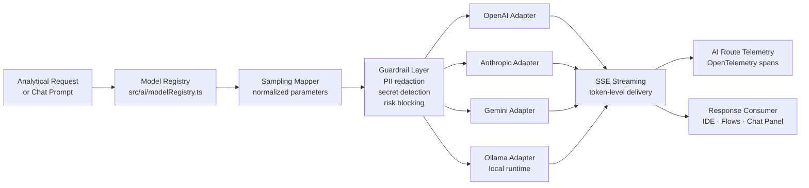
```mermaid
flowchart LR
  REQ[Analytical Request\nor Chat Prompt]
  REQ --> REG[Model Registry\nsrc/ai/modelRegistry.ts]
  REG --> SM[Sampling Mapper\nnormalized parameters]
  SM --> GUARD[Guardrail Layer\nPII redaction\nsecret detection\nrisk blocking]

  GUARD --> OAI[OpenAI Adapter]
  GUARD --> ANT[Anthropic Adapter]
  GUARD --> GEM[Gemini Adapter]
  GUARD --> OLL[Ollama Adapter\nlocal runtime]

  OAI --> SSE_AI[SSE Streaming\ntoken-level delivery]
  ANT --> SSE_AI
  GEM --> SSE_AI
  OLL --> SSE_AI

  SSE_AI --> TEL[AI Route Telemetry\nOpenTelemetry spans]
  SSE_AI --> RES[Response Consumer\nIDE · Flows · Chat Panel]
```

### 8.2 Guardrail System

| Guardrail | Description |
| --- | --- |
| PII pattern redaction | Phone numbers, email addresses, ID patterns scrubbed from prompts before transmission |
| Secret detection | API keys and credentials blocked before transmission |
| Risky command blocking | Destructive shell commands caught before code-insert |
| Urban analytics context | Domain-aware system prompts with spatial data awareness |
| Map AI guardrails | Layer action proposals reviewed via `MapAIGuardrails.ts` before map mutation |
| Streaming integrity | Token-level delivery with structured error propagation |

### 8.3 Provider Configuration

| Provider | Environment Key | Notes |
| --- | --- | --- |
| OpenAI | `VITE_OPENAI_API_KEY` | SSE token stream |
| Anthropic | `VITE_ANTHROPIC_API_KEY` | SSE token stream |
| Google Gemini | `VITE_GEMINI_API_KEY` | SSE token stream |
| Ollama (local) | `VITE_OLLAMA_BASE_URL` | No key required |

---

## 9. Synapse IDE Shell

### 9.1 Editor and File System Components

| Component | Technology | Capability |
| --- | --- | --- |
| Code editor | Monaco Editor 0.52 | Python, TypeScript, GeoJSON, YAML, Markdown |
| Terminal | xterm.js 6 + node-pty | Full PTY-backed terminal with shell integration |
| File explorer | Custom tree view | GIS file icons: SHP, GeoJSON, TIF, GPKG, CSV |
| Search | Fuse.js | Fuzzy file and symbol search across workspace |
| Command palette | Custom registry | Keyboard-first navigation to all major actions |
| Note editor | Custom surface | Analytical session notes with persistence |

### 9.2 Python Geospatial Environment

60+ geospatial packages available via `conda env create -f environment.yml`:

| Package Group | Key Packages |
| --- | --- |
| Vector GIS | GeoPandas, Shapely, Fiona, pyproj, Rtree |
| Network Analysis | OSMnx, NetworkX, pandana |
| Urban Morphology | momepy, pysal, esda, libpysal |
| Raster | rasterio, GDAL, xarray, rioxarray, earthengine-api |
| Machine Learning | scikit-learn, scipy, numpy, pandas |
| Visualization | matplotlib, folium |
| Database | DuckDB, psycopg2, SQLAlchemy |
| Notebook | JupyterLab, nbformat, nbconvert |

---

## 10. Evidence and Validity Model

### 10.1 Evidence Artifact Lifecycle

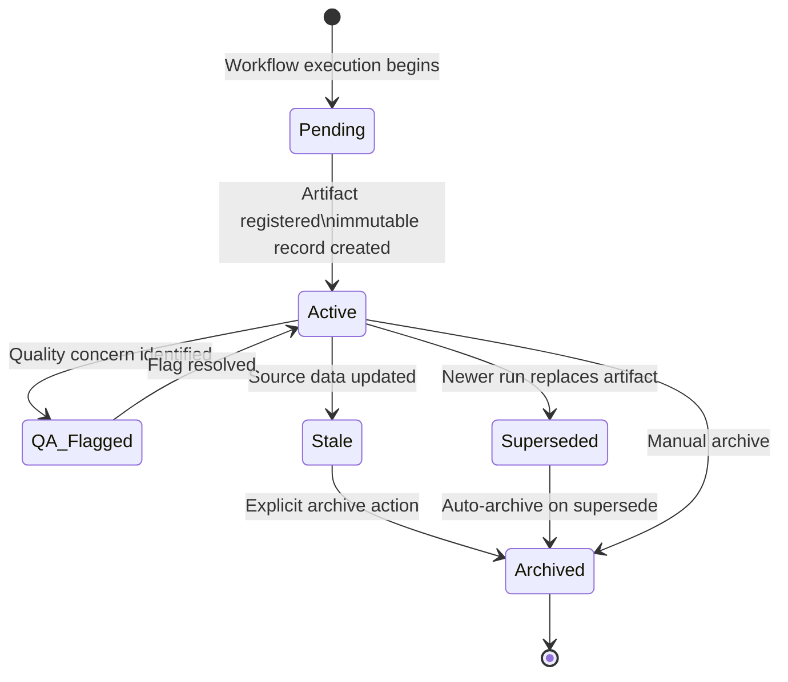
```mermaid
stateDiagram-v2
  [*] --> Pending : Workflow execution begins
  Pending --> Active : Artifact registered\nimmutable record created
  Active --> QA_Flagged : Quality concern identified
  Active --> Stale : Source data updated
  Active --> Superseded : Newer run replaces artifact
  QA_Flagged --> Active : Flag resolved
  Stale --> Archived : Explicit archive action
  Superseded --> Archived : Auto-archive on supersede
  Active --> Archived : Manual archive
  Archived --> [*]
```

**Immutability contract:** an `UrbanEvidenceArtifact` is an immutable record once created. The platform communicates change through QA state transitions, never through silent mutation of historical evidence.

**Capacity limit:** 200 `UrbanEvidenceArtifact` instances per context session.

### 10.2 Data Fitness Scoring

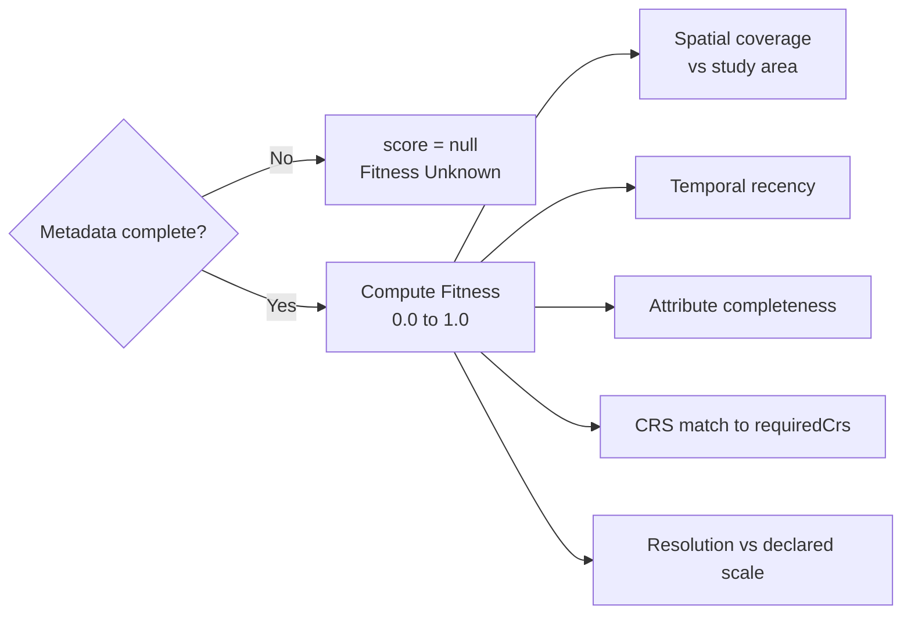
```mermaid
flowchart LR
  META{Metadata complete?}

  META -- No --> NULL_F[score = null\nFitness Unknown]
  META -- Yes --> CALC_F[Compute Fitness\n0.0 to 1.0]

  CALC_F --> F1[Spatial coverage\nvs study area]
  CALC_F --> F2[Temporal recency]
  CALC_F --> F3[Attribute completeness]
  CALC_F --> F4[CRS match to requiredCrs]
  CALC_F --> F5[Resolution vs declared scale]
```

**Rule:** `score = null` is unknown. It is never treated as high fitness. It is never auto-promoted.

### 10.3 CRS Enforcement Policy

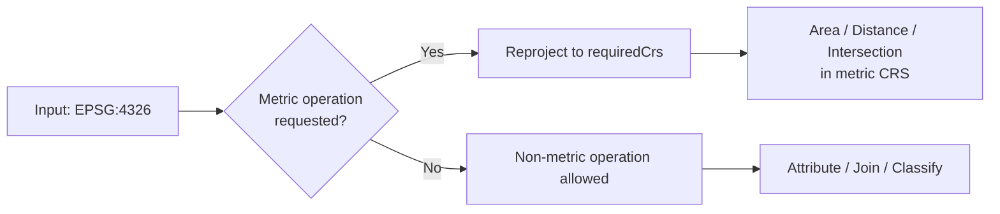
```mermaid
flowchart LR
  GEO_IN[Input: EPSG:4326] --> CHK_CRS{Metric operation\nrequested?}
  CHK_CRS -- Yes --> PROJ_CRS[Reproject to requiredCrs]
  CHK_CRS -- No --> PASS_CRS[Non-metric operation allowed]
  PROJ_CRS --> CALC_CRS[Area / Distance / Intersection\nin metric CRS]
  PASS_CRS --> CALC2_CRS[Attribute / Join / Classify]
```

**Hard rule:** metric area or distance computation in EPSG:4326 geographic degrees is architecturally blocked. Every method declares its `requiredCrs` explicitly.

### 10.4 Scientific QA State Machine

The Map Explorer's per-layer scientific QA state (`MapScientificQA.ts`) tracks the validation lifecycle:

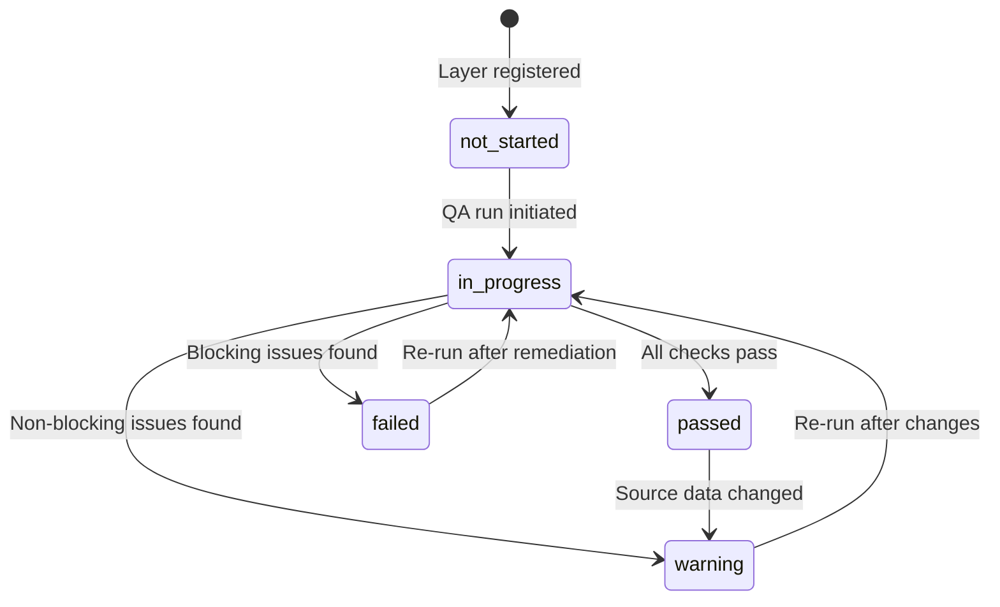
```mermaid
stateDiagram-v2
  [*] --> not_started : Layer registered
  not_started --> in_progress : QA run initiated
  in_progress --> passed : All checks pass
  in_progress --> warning : Non-blocking issues found
  in_progress --> failed : Blocking issues found
  warning --> in_progress : Re-run after changes
  failed --> in_progress : Re-run after remediation
  passed --> warning : Source data changed
```

---

## 11. Technology Stack

| Layer | Technology | Version | Purpose |
| --- | --- | --- | --- |
| **Framework** | React | 19 | UI rendering with concurrent features |
| **Language** | TypeScript | 5.8 | Strict typing with `exactOptionalPropertyTypes` |
| **Build** | Vite | 8.x | Dev server and production build |
| **State** | Zustand + Immer | 5 + 10 | Fine-grained reactive stores with immutable producers |
| **Maps** | deck.gl | 9.1 | GPU-accelerated WebGL2 geospatial layers |
| ^ | Mapbox GL | 3.9 | Basemaps, geocoding, tile rendering |
| ^ | MapLibre GL | 4.7 | Open-source tile renderer |
| ^ | Google Maps API | latest | Full Platform integration |
| **3D** | Three.js | 0.177 | 3D scene graph, geometry, materials |
| ^ | React Three Fiber | 9.5 | Declarative Three.js |
| ^ | @react-three/drei | 10.7 | Three.js helper primitives |
| ^ | @react-three/postprocessing | 3.0 | Bloom, depth-of-field |
| ^ | Potree Core | 2.0 | Point cloud rendering |
| **Spatial** | Turf.js | 7.2 | Geometric operations |
| ^ | H3-js | 4.2 | Hexagonal spatial indexing |
| ^ | Supercluster | 8.0 | Point clustering |
| ^ | GEOS-WASM | 2.0 | GEOS geometry engine |
| ^ | GDAL3.js | 2.8 | Format conversion |
| ^ | proj4 | 2.15 | CRS reprojection |
| ^ | s2-geometry | 1.2 | S2 spherical indexing |
| **Data** | DuckDB-WASM | 1.33 | In-browser analytical SQL |
| ^ | Apache Arrow | 17.0 | Columnar data transport |
| ^ | Arquero | 5.4 | In-browser data frame operations |
| ^ | loaders.gl | 4.3 | CSV, SHP, GPKG, GeoTIFF, LAS, NetCDF, WMS |
| ^ | FlatGeobuf | 3.35 | Streaming flat binary GeoJSON |
| ^ | PMTiles | 4.2 | Cloud-optimized raster/vector tiles |
| ^ | shpjs | 6.1 | Shapefile parsing |
| ^ | papaparse | 5.5 | CSV parsing |
| ^ | parquet-wasm | 0.6 | Parquet I/O |
| **Charts** | Recharts | 3.3 | Analytical chart components |
| ^ | Plotly.js | 2.35 | Scientific interactive charts |
| ^ | Chart.js | 4.5 | Flexible chart library |
| ^ | D3 (modular) | v3 | Geometric computation and scales |
| **AI** | OpenAI SDK | 5.3 | GPT model streaming |
| ^ | ONNX Runtime Web | 1.22 | Browser-side model inference |
| ^ | TensorFlow.js | 4.22 | Browser-side ML |
| **Editor** | Monaco Editor | 0.52 | VS Code editor in browser |
| ^ | xterm.js | 6.0 | Terminal emulator |
| **UI** | styled-components | 6.1 | Shell and layout theming |
| ^ | Radix UI | latest | Headless accessible primitives |
| ^ | Framer Motion | 12.18 | Animation and transitions |
| ^ | Lucide React | 0.515 | Icon library |
| ^ | KaTeX | 0.16 | Mathematical formula rendering |
| **Observability** | OpenTelemetry | latest | Distributed tracing and metrics |
| **Python** | GeoPandas + OSMnx + momepy + PySAL + rasterio + Earth Engine | various | 60+ geospatial packages |

---

## 12. Quickstart

### 12.1 Prerequisites

- **Node.js** v20 LTS or later
- **npm** (bundled with Node)
- **Python 3.12+** and **conda/mamba** (for the Python geospatial environment)

### 12.2 Install and Run

```bash
npm install
npm run dev
```

Vite serves the application at `http://localhost:5173`. The terminal server starts on port 9231.

```bash
# Alternate port if 5173 is occupied
npm run dev:safe
# Serves at http://localhost:3000
```

### 12.3 Environment Variables

Create `.env` or `.env.local` in the project root:

```bash
# Map Providers
VITE_MAPBOX_ACCESS_TOKEN=pk.…            # Mapbox GL basemaps and geocoding
VITE_GOOGLE_MAPS_API_KEY=AIza…           # Google Maps, Places, Directions, Street View

# AI Providers — all optional, enable any combination
VITE_OPENAI_API_KEY=sk-…
VITE_ANTHROPIC_API_KEY=…
VITE_GEMINI_API_KEY=…
VITE_OLLAMA_BASE_URL=http://localhost:11434

# Observability
VITE_OTLP_HTTP=http://localhost:4318/v1/traces
VITE_PROFILE=dev                         # dev | staging | prod

# GeoAI runtime — optional
VITE_GEOAI_OBJECT_DETECTION_MODEL_URL=/models/yolo-nano-urban-local-smoke.onnx
VITE_GEOAI_OBJECT_DETECTION_BACKEND=wasm
```

### 12.4 Python Environment

```bash
conda env create -f environment.yml
conda activate urban-analytics
# Installs 60+ geospatial packages including GeoPandas, rasterio, OSMnx,
# momepy, PySAL, Earth Engine API, DuckDB, and JupyterLab
```

### 12.5 Development Commands

| Command | Purpose |
| --- | --- |
| `npm run dev` | Start Vite dev server and terminal server |
| `npm run build` | Production build (12 GB heap) |
| `npm run typecheck` | `tsc --noEmit` — run after every change |
| `npm run lint:errors` | ESLint errors-only gate |
| `npm run lint:no-tailwind-centerpanel` | Fail if Tailwind found in centerpanel (CI enforced) |
| `npm run format` | Prettier formatting |
| `npm run test` | Full Vitest unit and integration suite |
| `npm run test:analytics` | Analytics and engine subset — fastest for UA work |
| `npm run test:e2e` | Full Playwright suite (requires running dev server) |
| `npm run test:e2e:smoke` | `@smoke`-tagged walkthroughs only |
| `npm run test:e2e:a11y` | Playwright + axe accessibility audit |
| `npm run perf:budgets` | Bundle budget enforcement |
| `npm run color:guard` | Color palette regression check |
| `npm run deadcode` | ts-prune dead export scan |
| `npm run validate:rc` | **Full release candidate gate** |

**Mandatory after any change to `src/features/urbanAnalytics/`:**

```bash
npm run typecheck && npm run test:analytics
```

---

## 13. Release Validation Ladder

### 13.1 Gate Structure

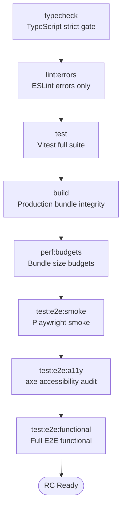
```mermaid
flowchart TD
  A[typecheck\nTypeScript strict gate] --> B
  B[lint:errors\nESLint errors only] --> C
  C[test\nVitest full suite] --> D
  D[build\nProduction bundle integrity] --> E
  E[perf:budgets\nBundle size budgets] --> F
  F[test:e2e:smoke\nPlaywright smoke] --> G
  G[test:e2e:a11y\naxe accessibility audit] --> H
  H[test:e2e:functional\nFull E2E functional] --> I
  I([RC Ready])
```

Run all gates in sequence:

```bash
npm run validate:rc
```

### 13.2 CI Split

| Gate | Scope | CI check |
| --- | --- | --- |
| `validate:pr` | typecheck + lint + analytics tests + build + budgets | PR merge gate |
| `test:e2e:smoke` | Major flows and release surfaces | Separate smoke check |
| `test:e2e:a11y` | axe accessibility violations | Separate a11y check |
| `test:e2e:functional` | All remaining Playwright specs | Separate functional check |

### 13.3 Testing Coverage

| Test Type | Location | Notes |
| --- | --- | --- |
| Unit and integration | `src/**/__tests__/` | 200+ test cases across calculators, engines, services |
| E2E functional | `e2e/` | 50+ Playwright specs covering all major flows and surfaces |
| Accessibility audits | `e2e/accessibility-audit.spec.ts` | axe audit across all major rendered surfaces |
| Performance budgets | `scripts/check-bundle-budgets.mjs` | Per-chunk size limits for heavy library isolation |

---

## 14. Scientific Limits and Integrity

### 14.1 Explicit Limits

- GeoAI detection is browser-side candidate screening, not a validated production detector
- Sunlight simulation computes geometric shadow projection — it does not model atmospheric scattering or diffuse radiation
- Network accessibility isochrones use simplified impedance functions, not demand-responsive modelling
- Cellular automata growth is a conceptual scenario tool, not a calibrated land-use forecasting model
- System dynamics flows are parameter explorations, not validated policy system models
- Composite indicator scores reflect method and weighting choices — they are not objective rankings
- VoxCity 3D is a visualization of building volumes, not a structural model or certified digital twin

### 14.2 Why It Is Still Scientifically Strong

- Every indicator is backed by a published primary reference
- Every flow declares an explicit analytical boundary in `FlowLibraryItem.boundary`
- Every method exposes a `UrbanMethodValidityEnvelope` with scale, CRS, and limitation declarations
- Evidence artifacts are immutable and provenance-tracked
- Data fitness surfaces `null` explicitly rather than auto-inflating confidence
- AI outputs are guardrail-filtered and telemetry-tracked
- CRS enforcement is architectural, not advisory
- The Scientific QA state machine (`MapScientificQA.ts`) enforces QA lifecycle at the map layer level

### 14.3 Scientific Reference Layer

| Framework | Application in Platform |
| --- | --- |
| Spacematrix (Berghauser Pont & Haupt, 2010) | FAR, GSI, OSR morphology calculators |
| Walk Score methodology (Carr et al., 2010) | Walk Score calculator with 9-category decay |
| Hansen accessibility (Hansen, 1959) | Gravity accessibility and cumulative opportunity measures |
| IPCC vulnerability framework | Vulnerability and Risk Assessment flow structure |
| SoVI method (Cutter et al., 2003) | Social Vulnerability Index calculator |
| UN-Habitat SDG 11 metadata (2023) | All six SDG 11 sub-indicators |
| Gini (1912) | Income inequality calculator |
| Space Syntax (Hillier & Hanson, 1984) | Network integration analysis |
| Moran's I (Moran, 1950) | Spatial autocorrelation engine |
| Getis-Ord Gi* (Getis & Ord, 1992) | Spatiotemporal hot spot classification |
| OECD/JRC Handbook on Composite Indicators (2008) | Composite indicator construction methodology |
| Rouse et al. (1973) | NDVI remote sensing indicator |
| McFeeters (1996) | NDWI water index |
| Oke (1982) | Urban Heat Island intensity formulation |

---

## 15. Project Structure

```text
src/
├── ai/                          # Model registry, sampling mapper, provider clients
├── app/                         # AppRoot, theme provider, error boundary
├── centerpanel/
│   ├── Flows/                   # 16 analytical flow builders + shells + FlowHost
│   │   ├── AccessibilityFlow.tsx
│   │   ├── CellularAutomataFlow.tsx
│   │   ├── ChangeDetectionFlow.tsx
│   │   ├── CityJSONFlow.tsx
│   │   ├── CompositeIndicatorFlow.tsx
│   │   ├── EmergingHotSpotFlow.tsx
│   │   ├── EquityAuditFlow.tsx
│   │   ├── FacilityOptimisationFlow.tsx
│   │   ├── ObjectDetectionFlow.tsx
│   │   ├── ScenarioComparisonFlow.tsx
│   │   ├── SiteSuitabilityFlow.tsx
│   │   ├── SunlightSimFlow.tsx
│   │   ├── SystemDynamicsFlow.tsx
│   │   ├── UrbanMorphologyFlow.tsx
│   │   ├── VoxCity3DFlow.tsx
│   │   ├── VulnerabilityFlow.tsx
│   │   └── flowLibraryMeta.ts   # Validity envelopes + boundary declarations
│   ├── Guide/                   # Urban analytics guide system
│   ├── Note/                    # Analytical session notes
│   ├── Tools/                   # Export, PDF, sharing tools
│   └── components/map/          # Map Explorer UI components
├── components/
│   ├── ai/                      # Chat panels, composer, provider settings
│   ├── editor/                  # Monaco integration
│   ├── file-explorer/           # GIS-aware file browser
│   ├── ide/                     # IDE shell, command palette, global search
│   ├── map/
│   │   ├── google/              # Google Maps, Places, Directions, Street View
│   │   └── layers/              # 14+ deck.gl layer implementations
│   ├── settings/                # Application settings
│   └── terminal/                # xterm.js terminal component
├── engine/
│   ├── carto/                   # Carto.com platform integration
│   ├── geoai/                   # ONNX Runtime browser inference pipeline
│   ├── gpu/                     # WebGPU spatial compute + WGSL shaders
│   ├── network/                 # Routing, space syntax, graph analysis
│   ├── spatial-db/              # DuckDB-WASM spatial database
│   ├── spatial-stats/           # Gi*, Moran's I, LISA, GWR
│   ├── streaming/               # MQTT + WebSocket real-time geodata
│   └── wasm/                    # GEOS-WASM, GDAL-WASM, SpatialIndexWASM
├── features/
│   └── urbanAnalytics/
│       ├── calculators/         # 40+ indicator pure functions — 14 modules
│       ├── context/             # Evidence artifact registry, method validity
│       ├── lib/                 # Core domain types — ~2 070 lines
│       ├── seeds/               # 16+ seed method/dataset card modules
│       ├── store.ts             # Navigation + card library filtering store
│       └── useUrbanContextStore.ts  # Context kernel — immer + persist
├── observability/               # OpenTelemetry setup, spans, metrics
├── services/
│   ├── ai/                      # Provider adapters, guardrails, structured output
│   ├── data/                    # External data connectors
│   ├── editorBridge.ts          # IDE code artifact bridge
│   ├── map/
│   │   ├── MapEngineAdapter.ts  # Layer publication API
│   │   ├── MapAIGuardrails.ts   # AI action safety layer
│   │   ├── MapScientificQA.ts   # Scientific QA state machine
│   │   └── contracts/
│   │       └── gisContracts.ts  # Shared GIS type contracts — import, never redefine
│   └── synapseBus.ts            # Typed cross-module event bus
├── stores/
│   ├── appStore.ts
│   ├── editorStore.ts
│   ├── useAiConfigStore.ts
│   ├── useFlowStore.ts
│   ├── useMapExplorerStore.ts
│   └── usePanelBridgeStore.ts
├── workers/
│   ├── gwrWorker.ts
│   ├── hashWorker.ts
│   ├── piiWorker.ts
│   ├── searchWorker.ts
│   └── pool/
│       └── BackgroundWorkerPool.ts
└── lib/
    └── error-bus.ts
```

---

## 16. Seed Card Library

The Urban Analytics seed library (`src/features/urbanAnalytics/seeds/`) populates the method and dataset card registry used by the right panel, flow suggestions, and learning paths.

| Seed Module | Domain Coverage |
| --- | --- |
| `projectScoping.ts` | Study area definition, data audit, stakeholder framing |
| `urbanIndicators.ts` | Morphology, accessibility, environmental, socioeconomic, SDG 11 |
| `additionalIndicators.ts` | Extended transport, water, energy, governance, heritage indicators |
| `vulnerability.ts` | Hazard, exposure, sensitivity, adaptive capacity frameworks |
| `transportNetworks.ts` | Network analysis, space syntax, service coverage, multimodal analysis |
| `remoteSensing.ts` | Satellite imagery, spectral analysis, change detection, object extraction |
| `spatialStats.ts` | Spatial autocorrelation, hot spots, clustering, interpolation |
| `thematicAnalysis.ts` | Choropleth, bivariate, cartogram, dasymetric mapping |
| `typologyClassification.ts` | Urban typology, morphotype clustering, land-use classification |
| `gisMethods.ts` | Overlay, proximity, join, buffer, dissolve, topology validation |
| `interventionDesign.ts` | Site design, feasibility, scenario planning methods |
| `monitoringReporting.ts` | Indicator tracking, SDG reporting, dashboard compilation |
| `policyImplementation.ts` | Decision support, compliance checking, impact assessment |
| `dataEngineering.ts` | Schema normalization, CRS harmonization, pipeline methods |
| `supplementary.ts` | Participatory methods, qualitative integration |
| `voxcity.ts` | VoxCity 3D, CityJSON, shadow simulation, solar analysis |

---

## 17. Architecture Rules

These rules are enforced at the type system, CI, or architectural contract level.

| Rule | Enforcement |
| --- | --- |
| No Tailwind in `src/centerpanel/` | `npm run lint:no-tailwind-centerpanel` in CI |
| Metric distance/area never in EPSG:4326 | `requiredCrs` TypeScript contract on every method |
| `prop?: string` is not `prop: string \| undefined` | `exactOptionalPropertyTypes: true` in tsconfig |
| Evidence artifacts are immutable | No mutation methods on `UrbanEvidenceArtifact` |
| No demo data labeled as real | `capabilityStatus` contract — `demo_mode` label required |
| All state in Zustand only | No Redux, no Context API for app state |
| No direct `localStorage` access | Zustand `persist` middleware with namespaced keys |
| `score = null` means unknown | `null` is never treated as high fitness |
| Bus payloads — IDs and refs only | No raw GeoJSON or bulk geometry through `synapseBus` |
| 200 artifact limit per session | Enforced in `context/evidenceArtifacts.ts` |
| CSS Modules in centerpanel | camelCase in JSX, kebab-case in `.module.css` |
| No heavy geometry through events | Consumers read their own store after bus events |

---

## 18. Documentation Map

| Document | Location |
| --- | --- |
| Map Explorer workflow guide | [docs/map-explorer-workflow-guide.md](docs/map-explorer-workflow-guide.md) |
| Map source support matrix | [docs/map-source-support-matrix.md](docs/map-source-support-matrix.md) |
| Public API reference | [docs/api/public-api.md](docs/api/public-api.md) |
| Architecture decisions | [docs/architecture/README.md](docs/architecture/README.md) |
| Release validation record | [docs/release/release-candidate-validation.md](docs/release/release-candidate-validation.md) |
| Visual completeness checklist | [docs/release/visual-completeness-checklist.md](docs/release/visual-completeness-checklist.md) |
| Known risks and limitations | [docs/release/known-risks-and-limitations.md](docs/release/known-risks-and-limitations.md) |
| Testing standards | [docs/implementation/testing-and-validation.md](docs/implementation/testing-and-validation.md) |
| Phase changelog | [CHANGELOG.md](CHANGELOG.md) |

---

## 19. Observability and Error Handling

### 19.1 OpenTelemetry

| Signal | Path | Purpose |
| --- | --- | --- |
| Traces | `src/observability/otel.ts` | Request lifecycle spans |
| Spans | `src/observability/spans.ts` | Fine-grained operation spans |
| AI Route Telemetry | `src/observability/aiRouteTelemetry.ts` | Provider routing, token counts, latency |
| Metrics | `src/observability/metrics.ts` | Counters and histograms |

Configure export endpoint:

```bash
VITE_OTLP_HTTP=http://localhost:4318/v1/traces
VITE_PROFILE=dev
```

### 19.2 Centralized Error Bus

```typescript
import { reportError } from '@/lib/error-bus';

reportError({
  source: 'adapter',    // 'http' | 'adapter' | 'fsm' | 'ui' | 'unknown'
  code: 'LAYER_LOAD_FAILED',
  message: 'Could not load GeoJSON layer',
  detail: err.message,
});
```

`reportError` deduplicates within 2 seconds, maps to a toast notification, and emits to all registered error listeners. Never call `showToast` directly for error conditions.

---

## 20. Why This Platform Is Different

Most GIS visualization platforms stop at basemaps, popups, and styled polygons.

Synapse Urban Analytics Workbench is built at the intersection of three things that rarely coexist in the same product.

### 20.1 Scientific Depth Without Scientific Pretense

Every indicator is traceable to a published method. Every flow declares what it produces and what it does not produce. Every evidence artifact has an immutable provenance record. When data quality is unknown, the platform says so — `score = null` is always visible in the UI.

The Getis-Ord $G_i^*$ statistic used in the Emerging Hot Spot flow is the same equation published in Getis & Ord (1992). The SoVI composite is constructed on the same dimensional structure as Cutter et al. (2003). The SDG 11.2.1 threshold of 500 m and 20-minute service frequency comes directly from UN-Habitat metadata. None of this is approximated away, and none of it is hidden in a black box.

### 20.2 Production Engineering Without Compromise

TypeScript strict mode with `exactOptionalPropertyTypes`. Zustand fine-grained selectors with immutable producers. Worker-isolated computation for regression and indexing. WebGPU raster processing with transparent CPU fallback. Bundle budgets enforced at CI. Accessibility audited at every release. Architecture rules enforced by the type system rather than only by documentation.

The 50+ Playwright specs cover not just smoke paths but also choropleth rendering, temporal playback, evidence publication, AI guardrails, streaming ingestion, and accessibility tree structure.

### 20.3 An Analytical Instrument, Not a Demo

The interface is premium, but it earns its density. Context is always visible. Scientific state is always legible. Every surface connects to the method logic behind it.

The command palette reaches every analytical flow, indicator, and map operation from one keyboard shortcut. The evidence registry persists across sessions. The data fitness score tells you exactly why the platform is uncertain about a layer, not just that it is uncertain.

The Scientific QA system visible in the screenshots is not decorative. When the Problems panel shows `Missing CRS metadata` with a `Declare CRS` button, it is enforcing the principle that scientific analysis requires documented projections — and making it actionable in one click.

In short:

this is not a GIS tool that looks like a planning cockpit.

This is a planning cockpit — built on rigorous GIS foundations, explicit analytical science, and production-grade TypeScript engineering.

---

Synapse Urban Analytics Workbench — June 2026
