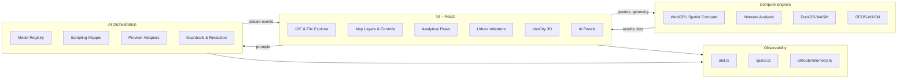

# Urban Analytics Workbench


---

## Overview

Urban Analytics Workbench is a browser-based spatial intelligence platform for urban scientists, planners, GIS analysts, and data engineers. It consolidates data acquisition, spatial analysis, indicator computation, 3D visualization, and AI-assisted reporting into a single integrated environment built on top of a full-featured IDE shell.

**Key capabilities:**

- **Multi-layer map engine** — deck.gl 9, Mapbox GL, MapLibre GL, and Google Maps Platform with 15+ specialized visualization layers (choropleth, heatmap, flow map, isochrone, building, voxel, point cluster, network, raster tile, and more)
- **40+ urban indicators** — Walkability, accessibility, NDVI, urban heat island, Gini coefficient, social vulnerability, SDG 11 metrics, FAR/GSI/OSR, and compound risk indices
- **Structured analytical flows** — Multi-criteria site suitability, network accessibility, land-use change detection, vulnerability & risk assessment, equity & distributional audit, and composite indicator builder
- **3D & VoxCity visualization** — Three.js / React Three Fiber voxel city rendering, point cloud support (Potree), 3D Tiles, and Google Street View integration
- **Spatial compute engines** — WebGPU-accelerated spatial operations, DuckDB-WASM in-browser SQL, network analysis (routing, space syntax), GEOS-WASM geometry processing, and H3 hexagonal indexing
- **Multi-provider AI orchestration** — OpenAI, Anthropic, Gemini, and local Ollama with normalized sampling parameters, streaming, guardrails, and PII redaction
- **Full IDE surface** — Monaco editor with Python/GeoJSON modes, file explorer with GIS file icons, integrated terminal, command palette, and global search
- **Python environment** — 60+ geospatial packages (GeoPandas, OSMnx, momepy, Earth Engine, GDAL, rasterio, xarray) via conda/mamba
- **Observability** — OpenTelemetry tracing and metrics, structured error boundaries, AI route telemetry

---

## Quickstart

### Prerequisites

- **Node.js** v20.x LTS or later
- **npm** (bundled with Node)
- **Python 3.12+** and **conda/mamba** (for the geospatial Python environment)

### Install and run

```bash
npm install
npm run dev
```

Vite serves the app at `http://localhost:5173` by default (or `http://localhost:3000` with `npm run dev:safe`).

### Environment variables

Create a `.env` file (or set variables in your platform):

```bash
# Map providers (at least one recommended)
VITE_MAPBOX_ACCESS_TOKEN=pk.…          # Mapbox GL basemaps & geocoding
VITE_GOOGLE_MAPS_API_KEY=AIza…         # Google Maps, Places, Directions, Street View

# AI providers (optional — enable any combination)
VITE_OPENAI_API_KEY=sk-…               # OpenAI
VITE_ANTHROPIC_API_KEY=…               # Anthropic
VITE_GEMINI_API_KEY=…                  # Google Gemini
VITE_OLLAMA_BASE_URL=http://localhost:11434  # Local Ollama

# Observability (optional)
VITE_OTLP_HTTP=http://localhost:4318/v1/traces
VITE_PROFILE=dev                       # dev | staging | prod

# GeoAI object detection smoke-model path (optional local runtime validation)
VITE_GEOAI_OBJECT_DETECTION_MODEL_URL=/models/yolo-nano-urban-local-smoke.onnx
VITE_GEOAI_OBJECT_DETECTION_BACKEND=wasm
```

For the object-detection real runtime path, the repository now includes a tiny browser-loadable smoke model at `public/models/yolo-nano-urban-local-smoke.onnx`. Set `VITE_GEOAI_OBJECT_DETECTION_MODEL_URL=/models/yolo-nano-urban-local-smoke.onnx` in `.env.local` to exercise the real `onnxruntime-web` path without the mocked runtime seam. This fixture is only a runtime-validation model: it emits a deterministic sample detection so the browser-managed loading/inference/publication path can be tested locally, but it is not a production urban detector.

### Python geospatial environment

```bash
conda env create -f environment.yml
conda activate urban-analytics
```

This installs 60+ geospatial packages including GeoPandas, rasterio, OSMnx, momepy, PySAL, Earth Engine API, DuckDB, and JupyterLab.

---

## Release Candidate

The current repository state is hardened as a release candidate dated **April 23, 2026**.

- **In-app feature index:** `Toolbox` → `Capabilities Overview`
- **Release validation record:** [`docs/release/release-candidate-validation.md`](docs/release/release-candidate-validation.md)
- **Visual completeness checklist:** [`docs/release/visual-completeness-checklist.md`](docs/release/visual-completeness-checklist.md)
- **Known risks and limitations:** [`docs/release/known-risks-and-limitations.md`](docs/release/known-risks-and-limitations.md)
- **Phase-grouped release summary:** [`CHANGELOG.md`](CHANGELOG.md)

Run the full local release gate with:

```bash
npm run validate:rc
```

---

## Architecture

### Layered view

```
┌─────────────────────────────────────────────────────────┐
│  UI Layer — React 19, styled-components, Radix UI       │
│  Maps: deck.gl · Mapbox GL · Google Maps · MapLibre     │
│  3D: Three.js · React Three Fiber · Potree              │
│  Charts: Recharts · Plotly · Chart.js                   │
├─────────────────────────────────────────────────────────┤
│  Domain Layer — Urban Analytics                         │
│  Indicators · Flows · Calculators · Store               │
├─────────────────────────────────────────────────────────┤
│  AI Orchestration                                       │
│  Registry · Sampling Mapper · Adapters · Guardrails     │
├─────────────────────────────────────────────────────────┤
│  Engine Layer                                           │
│  GPU Compute · Network Analysis · Spatial DB · WASM     │
│  Carto · GeoAI · Streaming                              │
├─────────────────────────────────────────────────────────┤
│  IDE Shell (preserved)                                  │
│  Monaco Editor · File Explorer · Terminal · Commands    │
├─────────────────────────────────────────────────────────┤
│  Observability — OpenTelemetry · Spans · Metrics        │
└─────────────────────────────────────────────────────────┘
```

### Component architecture



---

## Project Structure

```
src/
├── ai/                      # Model registry, sampling mapper, provider clients
├── app/                     # AppRoot, theme provider, error boundary
├── centerpanel/             # Center workspace panel
│   ├── Flows/               # Analytical flow builders & shells
│   │   ├── builders/        # Site suitability, vulnerability, equity, etc.
│   │   ├── shells/          # Flow layout templates
│   │   └── suggestions/     # AI-powered flow suggestions
│   ├── Guide/               # Urban analytics guide system
│   ├── Note/                # Note editor
│   ├── Tools/               # Export, PDF, sharing tools
│   ├── nav/                 # Navigation components
│   ├── rail/                # Rail panel components
│   ├── registry/            # Project registry (replaces patient registry)
│   ├── tabs/                # Tab management
│   └── timerHooks/          # Session timer & analytics
├── components/
│   ├── ai/                  # AI chat panels, composer, settings
│   ├── editor/              # Monaco editor integration
│   ├── file-explorer/       # File browser with GIS file support
│   ├── ide/                 # IDE shell, command palette, search
│   ├── map/                 # Map components
│   │   ├── google/          # Google Maps, Places, Directions, Street View
│   │   ├── hooks/           # Map hooks (export, state)
│   │   └── layers/          # Visualization layers (15+ types)
│   ├── settings/            # Application settings
│   └── terminal/            # Integrated terminal
├── engine/
│   ├── carto/               # Carto.com integration
│   ├── geoai/               # GeoAI models & algorithms
│   ├── gpu/                 # WebGPU spatial compute engine
│   ├── network/             # Routing, space syntax, graph analysis
│   ├── spatial-db/          # DuckDB-WASM spatial database
│   ├── streaming/           # Real-time geodata streaming (MQTT, WebSocket)
│   └── wasm/                # GEOS-WASM, GDAL-WASM modules
├── features/
│   └── urbanAnalytics/      # Urban analytics domain
│       ├── calculators/     # 40+ indicator calculators
│       ├── rail/            # Rail panel UI
│       └── voxcity/         # VoxCity 3D viewer
├── hooks/                   # Shared hooks (AI streaming, clipboard, voice)
├── observability/           # OpenTelemetry, spans, metrics
├── services/
│   ├── ai/                  # AI adapters, guardrails, structured output
│   └── data/                # Google Maps, Overpass, data connectors
├── state/                   # Application state
├── store/                   # Zustand stores
├── theme/                   # Charcoal-amber design tokens
└── workers/                 # Web workers (hash, search, redaction)
```

---

## Urban Indicators

The platform includes 40+ deterministic urban indicators organized into five categories:

### Morphology

| Indicator | Description |
|-----------|-------------|
| Floor Area Ratio (FAR) | Ratio of total floor area to lot area |
| Ground Space Index (GSI) | Building footprint coverage ratio |
| Open Space Ratio (OSR) | Open space per unit of gross floor area |
| Mixed-Use Index | Shannon entropy of land-use mix |
| Street Connectivity | Intersection density and connectivity index |

### Accessibility

| Indicator | Description |
|-----------|-------------|
| Walk Score | Pedestrian accessibility composite score |
| Transit Accessibility | Public transport service coverage index |
| Cumulative Opportunities | Count of reachable destinations within travel threshold |
| Gravity Accessibility | Distance-decay weighted opportunity measure |

### Environmental

| Indicator | Description |
|-----------|-------------|
| NDVI | Normalized Difference Vegetation Index from satellite imagery |
| Urban Heat Island Intensity | Surface temperature differential from rural baseline |
| Green Space Per Capita | Public green space area per resident |
| Tree Canopy Coverage | Percentage of canopy cover |
| Impervious Surface | Proportion of sealed/impervious land |

### Socioeconomic

| Indicator | Description |
|-----------|-------------|
| Gini Coefficient | Income inequality measure |
| Shannon / Simpson Diversity | Population diversity indices |
| Jobs-Housing Balance | Employment-to-housing ratio |
| Displacement Risk | Gentrification and displacement vulnerability |

### Resilience & SDG 11

| Indicator | Description |
|-----------|-------------|
| Social Vulnerability Index (SoVI) | Multi-dimensional social vulnerability |
| Flood Exposure | Population and assets in flood-prone zones |
| Adaptive Capacity | Community resilience capacity score |
| Compound Risk Index | Multi-hazard combined risk |
| SDG 11.1.1 – 11.7.1 | Six Sustainable Development Goal 11 indicators |

All indicators are deterministic, transparent, and documented in `src/features/urbanAnalytics/calculators/`.

---

## Analytical Flows

Structured analytical workflows guide users through multi-step spatial analysis:

| Flow | Category | Purpose |
|------|----------|---------|
| Multi-Criteria Site Suitability | Spatial Analysis | Weighted overlay for optimal development sites |
| Network Accessibility Analysis | Spatial Analysis | Isochrone-based accessibility scoring (walk, cycle, transit, drive) |
| Land-Use Change Detection | Spatial Analysis | Temporal satellite/vector comparison for urban expansion |
| Composite Indicator Builder | Indicator Assessment | Custom indices with configurable normalization & aggregation |
| Vulnerability & Risk Assessment | Risk & Equity | Multi-hazard vulnerability mapping (exposure, sensitivity, capacity) |
| Equity & Distributional Audit | Risk & Equity | Spatial equity analysis across demographic groups |

The full release workflow inventory, including object detection, CityJSON, VoxCity 3D, sunlight simulation, facility optimisation, urban growth cellular automata, system dynamics, scenario comparison, and completed-run review, is exposed from the in-app `Capabilities Overview` and documented in `src/centerpanel/Flows/flowLibraryMeta.ts`.

---

## Map Layers

15+ specialized visualization layers built on deck.gl:

- **ChoroplethLayer** — Thematic polygon mapping
- **HeatmapLayer** — Kernel density estimation
- **FlowMapLayer** — Origin-destination flow visualization
- **IsochroneLayer** — Travel-time accessibility zones
- **BuildingLayer** — 3D building extrusions
- **VoxelLayer** — Volumetric 3D data
- **PointClusterLayer** — Supercluster-based point aggregation
- **NetworkLayer** — Graph and network rendering
- **RasterTileLayer** — Raster basemaps and overlays

Plus drawing tools, geocoder search, layer manager, swipe comparison, temporal slider, scale bar, minimap, and spatial filter.

---

## Google Maps Integration

Full Google Maps Platform support:

- **Google Maps View** — Maps JavaScript API with custom styling
- **Places Search** — Autocomplete place search
- **Directions** — Route planning and display
- **Street View** — Immersive panorama viewer
- **deck.gl overlay** — deck.gl layers rendered on Google Maps basemap

---

## Engine Modules

| Module | Path | Description |
|--------|------|-------------|
| GPU Compute | `src/engine/gpu/` | WebGPU-accelerated spatial operations |
| Network Analysis | `src/engine/network/` | Routing (Dijkstra/A*), space syntax, graph metrics |
| Spatial DB | `src/engine/spatial-db/` | DuckDB-WASM in-browser SQL with spatial extensions |
| WASM | `src/engine/wasm/` | GEOS and GDAL compiled to WebAssembly |
| GeoAI | `src/engine/geoai/` | GeoAI models and spatial ML |
| Streaming | `src/engine/streaming/` | Real-time geodata via MQTT and WebSocket |
| Carto | `src/engine/carto/` | Carto.com platform integration |

---

## AI System

Multi-provider AI orchestration with normalized parameters:

- **Providers:** OpenAI, Anthropic (Claude), Google Gemini, Ollama (local)
- **Streaming:** Server-sent events with token-level delivery
- **Guardrails:** PII-like pattern redaction, secret detection, risky command blocking
- **Domain context:** Urban analytics system prompts and spatial data awareness
- **Telemetry:** AI route changes tracked via OpenTelemetry

Configuration in `src/ai/modelRegistry.ts`, adapters in `src/services/ai/adapters/`.

---

## Scripts

| Command | Description |
|---------|-------------|
| `npm run dev` | Start Vite dev server |
| `npm run build` | TypeScript check + production build |
| `npm run typecheck` | TypeScript compilation check (`tsc --noEmit`) |
| `npm run lint` | ESLint check |
| `npm run lint:errors` | ESLint errors-only gate used in CI and release validation |
| `npm run lint:fix` | ESLint auto-fix |
| `npm run test` | Full Vitest unit and integration suite |
| `npm run test:e2e:smoke` | Playwright smoke walkthroughs for major flows and release surfaces |
| `npm run test:e2e:a11y` | Playwright + axe accessibility audit |
| `npm run test:e2e:functional` | Remaining Playwright end-to-end suite excluding smoke and a11y |
| `npm run perf:budgets` | Manifest-driven bundle budget enforcement |
| `npm run validate:rc` | Release candidate validation gate: typecheck, lint, tests, build, budgets, E2E |
| `npm run format` | Prettier formatting |
| `npm run preview` | Preview production build |
| `npm run clean` | Remove dist and cache |

---

## Validation Stack

Release evaluation is intentionally explicit rather than implied:

| Gate | Command |
|------|---------|
| Type safety | `npm run typecheck` |
| Lint integrity | `npm run lint:errors` |
| Unit and integration tests | `npm run test` |
| Build integrity | `npm run build` |
| Bundle budgets | `npm run perf:budgets` |
| E2E smoke | `npm run test:e2e:smoke` |
| Accessibility | `npm run test:e2e:a11y` |
| Functional E2E | `npm run test:e2e:functional` |
| Full local RC gate | `npm run validate:rc` |

CI mirrors this split so smoke, accessibility, and the remaining functional Playwright suite are visible as separate release checks.

---

## Documentation Index

| Area | Document |
|------|----------|
| Public APIs | [`docs/api/public-api.md`](docs/api/public-api.md) |
| Architecture decisions | [`docs/architecture/README.md`](docs/architecture/README.md) |
| Release validation | [`docs/release/release-candidate-validation.md`](docs/release/release-candidate-validation.md) |
| Visual completeness | [`docs/release/visual-completeness-checklist.md`](docs/release/visual-completeness-checklist.md) |
| Known risks | [`docs/release/known-risks-and-limitations.md`](docs/release/known-risks-and-limitations.md) |
| Prompt 42 debt closure ledger | [`docs/implementation/prompt-42-completion.md`](docs/implementation/prompt-42-completion.md) |
| Testing standards | [`docs/implementation/testing-and-validation.md`](docs/implementation/testing-and-validation.md) |

---

## Tech Stack

| Category | Technologies |
|----------|-------------|
| **Framework** | React 19, TypeScript 5.8, Vite 8 |
| **State** | Zustand 5, Immer, React Query |
| **Maps** | deck.gl 9, Mapbox GL, MapLibre GL, Google Maps API |
| **3D** | Three.js, React Three Fiber, Potree, 3D Tiles |
| **Spatial** | Turf.js, H3, Supercluster, GEOS-WASM, GDAL, proj4 |
| **Data** | DuckDB-WASM, Arquero, PapaParse, loaders.gl (CSV, Shapefile, GeoPackage, GeoTIFF, LAS, NetCDF, WMS) |
| **Charts** | Recharts, Plotly, Chart.js, D3 |
| **AI** | OpenAI SDK, multi-provider adapters |
| **Editor** | Monaco Editor |
| **UI** | styled-components, Radix UI, Framer Motion, Lucide icons |
| **Observability** | OpenTelemetry (tracing + metrics) |
| **Python** | GeoPandas, OSMnx, momepy, PySAL, rasterio, Earth Engine, DuckDB, JupyterLab |

---

## Configuration

### Feature flags (`src/config/flags.ts`)

| Flag | Source | Purpose |
|------|--------|---------|
| `aiTrace` | `VITE_AI_TRACE` / `?trace=1` / localStorage | Extra AI debug output |
| `a11yEnabled` | `?a11y=1` / localStorage | Additional accessibility affordances |
| `simpleStream` | `VITE_SIMPLE_STREAM` | Simplified AI streaming path |
| `synapseCoreAI` | `VITE_SYN_CORE_AI` | Master AI panel switch |

### Environment profiles (`src/config/env.ts`)

| Profile | Sampling | Guardrails | Debug |
|---------|----------|------------|-------|
| `dev` | 100% | relaxed | enabled |
| `staging` | 100% | strict | enabled |
| `prod` | 15% | strict | disabled |

---

## License

See [LICENSE](LICENSE) for details.
